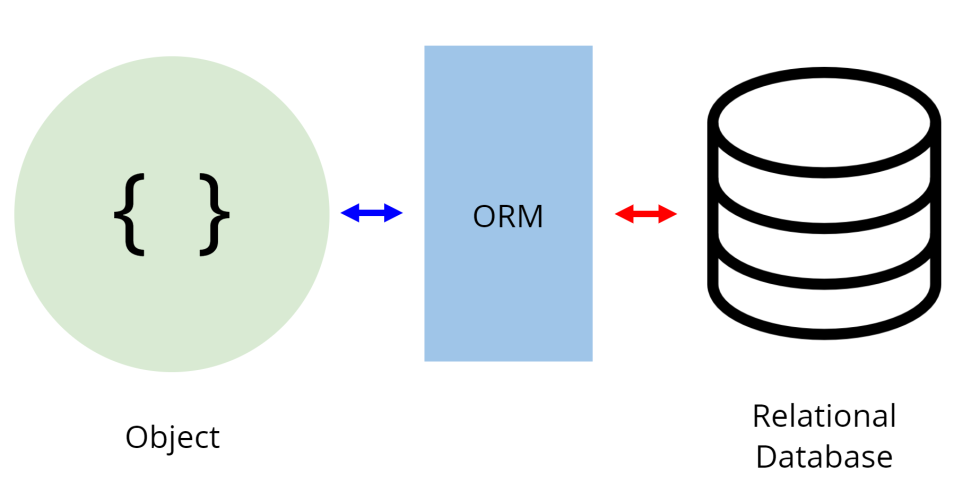
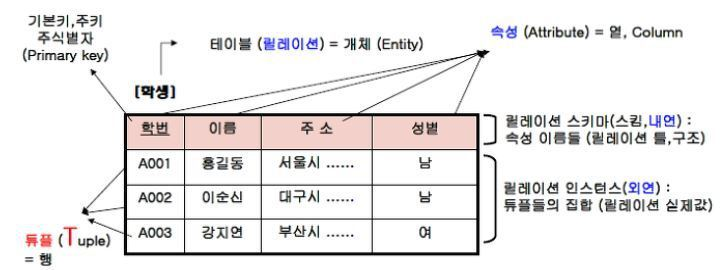

## ORM(Object-Relational Mapping) 이란

> 객체와 관계형 데이터베이스 간의 데이터를 자동으로 매핑 해주는 도구다. 설명하자면 프로그래밍 언어의 객체를 관계형 데이터베이스의 데이터로 매핑(연결)해 주거나 반대로 관계형 데이터베이스의 데이터를 프로그래밍 언어의 객체로 매핑해 주는것!

### 그럼 관계형 데이터베이스는 무엇인가

프로그래밍 언어의 객체는 알고 있으니 관계형DB에 대해 정리가 필요하다! 일단 관계형 데이터베이스는 데이터를 테이블이라 불리는 구조로 구성하며 각 테이블은 행과 열로 이루어져 있다! RDBMS라는 관계형 데이터베이스 관리 시스템을 사용해 설계, 생성, 수정, 관리되고 SQL(Structured Query Language)을 사용해 데이터에 접근,조작할 수있다.

- `테이블(Table)`: 행과 열의 형태로 데이터를 저장하는 기본 단위, 각 테이블은 고유한 이름을 가지며, 각 열은 속성(attribute)를 나타내고 각 행은 레코드(record)를 나타냄
- `열(Column)`: 테이블의 속성을 정의 하는 부분으로, 각 열은 특정 유형의 데이터를 저장하고, 열은 DB스키마에 따라 정의 된다. 이름,나이,주소 등의 정보를 저장하는 것
- `행(Row)`: 테이블의 각 행은 레코드 또는 튜플이라고 부르며, 테이블에 저장된 실제 데이터를 나타낸다. 각 행은 열의 값으로 구성되며, 하나의 레코드는 특정 열에 대한 데이터의 집합이다
- `키(Key)`: 데이터베이스에서 행을 식별하는데 사용되는 열 또는 열의 조합이다. 주요 키(primary key)는 각 행을 고유하게 식별하고 외래 키(foreign key)는 여러 테이블 간의 관계를 정의하는 데 사용 됨
- `관계(Relationship)`: 여러 테이블 간의 관계를 나타내는것으로, 테이블 간에 공통된 열이나 키를 사용하여 정의된다. 이를 통해 데이터의 무결성을 유지하고 관련된 정보를 효과적으로 조작할 수 있음.
- `SQL(Structured Query Language)`: 관계형 데이터베이스에서 데이터를 조작하기 위해 사용되는 표준화된 쿼리언어다. SQL을 사용해 데이터를 조회, 삽입, 갱신, 삭제를 수행할 수있다.

## ORM을 사용하는 이유!

1. 객체 지향 프로그래밍과 데이터베이스 간의 불일치 해소: 객체 지향 언어에서 사용되는 객체는 데이터베이스의 테이블과 레코드와 직접적으로 일치하지 않을 수 있는데, ORM을 사용하면 객체 모델과 데이터베이스 스키마 간의 불일치를 해소하고, 객체 지향 프로그래밍의 개념을 데이터베이스에 더 쉽게 매핑할 수 있다.
2. 코드의 가독성과 유지보수성 향상: ORM을 사용하면 SQL 쿼리를 직접 작성하는 대신 객체를 사용하여 데이터베이스 조작을 표현할 수 있다. 이렇게 하면 코드의 가독성이 향상되며, 복잡한 데이터베이스 조작에 대한 유지보수가 더 쉬워진다.
3. 생산성 향상: ORM은 데이터베이스와의 상호 작용을 추상화하고 일반적인 CRUD(Create, Read, Update, Delete) 작업을 간소화한다. 이는 개발자가 빠르게 응용 프로그램을 개발하고 데이터베이스와의 상호 작용을 효율적으로 처리할 수 있도록 도와준다.
4. 효과적인 데이터베이스 관리: ORM은 데이터베이스 스키마의 변경을 추적하고 자동으로 데이터베이스 마이그레이션을 수행한다. 이는 데이터베이스의 구조 변경에 대한 관리를 단순화하고 유연성을 제공한다.
