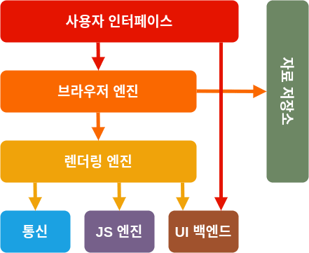

## 브라우저 구성 요소

 
 

## 브라우저 렌더링 원리란?

> 웹 브라우저에서는 뼈대를 그리는 HTML, 스타일을 꾸며주는 CSS와 그것의 동작을 수행하고 제어하는 JavaScript가 함께 실행 된다. 브라우저가 웹페이지를 불러올 때 렌더링 엔진이라는 소프트웨어 모듈이 사용되는데, 렌더링 엔진은 HTML,CSS, JavaScript와 같은 웹페이지의 요소들을 파싱하고, 이를 브라우저 화면에 표시하는 역할을 한다. **브라우저 렌더링 원리**는 크게 **렌더링엔진**, **렌더 트리**, **레이아웃**,**페인팅**으로 구성된다.

### ✔️ 렌더링 엔진

웹페이지를 불러올 때 HTML,CSS, JavaScript와 같은 웹페이지의 요소들을 파싱 한다.

- HTML : 문서 구조 정의
- cSS : 문서의 스타일 정의
- javaScript : 문서의 동작을 정의

### ✔️ 렌더 트리

렌더 트리는 브라우저가 화면에 표시할 요소들을 정의하는데, 렌더링 엔진이 파싱한 HTML,CSS와 같은 웹페이지 요소를 이용하여 구성한 트리구조이다.

### ✔️ 레이아웃

렌더 트리를 이용하여 브라우저의 화면에 요소들을 배치하는 과정이다. 이때 각 요소의 크기, 위치, 간격등을 계산한다

### ✔️ 페인팅

레이아웃을 이용해 계산된 위치에 요소들을 표시하는 과정! 브라우저는 렌더링 엔진에서 계산된 정보를 이용해 브라우저 화면에 그래픽 요소들을 표시한다!

 
 

## 파싱과 렌더링

### 파싱

> 프로그래밍 언어의 문법에 맞게 작성된 텍스트 문서를 읽고, 실행하기 위해 텍스트의 문자열을 분해하고 구조를 생성하는 일련의 과정

### 렌더링

> HTML, CSS, JavaSCript로 작성된 문서를 파싱하여 브라우저에 사용자가 눈으로 볼 수 있도록 시각적으로 출력 하는 것!

 
 

## 브라우저 렌더링 순서

#### 1. 사용자가 브라우저의 주소창에 URL을 입력

#### 2. 네트워크 요청

- 브라우저는 입력된 URL을 해석해 서버의 IP주소를 찾기 위해 DNS(Domain Name System) 서버에 요청을 보낸다
- DNS서버는 해당 도메인에 대한 IP주소를 응답하여 브라우저가 서버에 연결할 수 있게 해줌

#### 3. 서버 연결

- DNS에서 받은 IP주소로 서버에 HTTP 요청을 보낸다 이 요청엔 사용자의 브라우저 정보, 요청하는 페이지의 경로등이 포함됨

#### 4. 서버 응답

- 서버는 브라우저의 요청을 받고 요청된 페이지에 대한 HTML문서를 포함한 다양한 리소스(이미지, 스타일시트, JS파일 등)를 포함한 HTTP 응답을 반환 해준다.

#### 5. HTML 파싱

- 브라우저는 받은 HTML 문서를 파싱하여 DOM(Document Object Model)트리를 생성 한다
- 이 과정에서 각 HTML태그를 노드로 변환하고, 태그 간의 관계를 설정 한다!

- #### CSS 파싱( 스타일 처리 )

  - HTML 파싱 중에 `<style>`, `<link>`태그를 만나면 DOM 생성을 일시 중단하고, DOM을 만들듯 서버에 요청/응답 받은 CSS파일을 파싱해 **CSSOM(CSS Object Model)** 을 생성 한다. (CSS파싱이 완료 되면 중단 됐던 HTML 파싱 시점으로 돌아가 다시 작업함)
  - 이 과정에서 CSS선택자와 규칙을 분석하고 각 규칙의 적용 범위와 우선순위를 계산한다.

- #### JavaScript 파싱
      - HTML 파싱 도중에 `<script>` 태그를 만나면 DOM 생성을 일시 중단하고 해당 JS 파일을 다운로드 한다. 해당 파일을 파싱하여 자바스크립트 엔진에 의해 실행 가능한 코드로 변환한다.
      - 이 과정에서 문법적 오류를 확인, 함수와 변수 등을 인식 한다.
      - JS 코드 실행중에 DOM을 수정하고너 추가적인 CSS 스타일을 적용하는 경우, 브라우저는 렌더 트리와 레이아웃을 다시 계산하고, 변경된 내용을 화면에 반영한다. (이과정은 다시 페인팅과 합성 단계를 거쳐 화면에 새로운 내용을 렌더링 하는 것을 포함 한다.)

#### 7. 렌더 트리 생성

    - 생성된 DOM, CSSOM 트리를 결합해 렌더 트리를 생성한다.
    - 이 과정에서 브라우저는 레이아웃과 페인팅에 필요한 정보를 추출하고, 숨겨진 요소나 비표시 요소를 필터링 한다.

#### 8. 레이아웃

    - 렌더 트리의 각 요소애 대해 위치와 크기를 계산하여 레이아웃을 생성 한다.
    - 이 과정에서 각 요소의 박스모델, 위치 지정 방식(relative, absolute 등), 플로딩 등을 고려해 요소들을 화면에 배치한다.

#### 9. 페인팅

- 레이아웃이 완료되면 각 요소의 스타일 정보와 레이아웃 정보를 기반으로 실제 화면에 픽셀을 그리는 페인팅 과정을 수행한다.
- 이 과정에서 CSS 스타일, 색상, 텍스트, 이미지 등의 렌더링을 담당한다.

#### 10. 합성

- 페인팅 단계에서 생성된 레이어를 합성해 실제 화면에 렌더링 한다
- 이 과정에서 각 요소의 투명도, z-index등을 고려해 화면에 출력함
