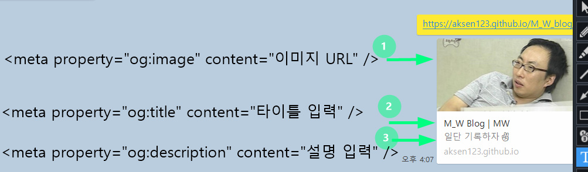

SEO(Search Engine Optimization)는 검색엔진최적화 라고 하는것. 그러니까 구글이나 네이버 같은 검색 엔진의 검색 결과 상위에 노출되도록 웹사이트나 콘텐츠를 최적화 하는 과정이라고 한다.

## 일단 google 검색단계를 이해해 보자

1. 크롤링(Crawling) : 검색 엔진이 웹사이트를 방문해 페이지를 수집하는 과정
    - 로봇이 인터넷상의 웹피이지를 탐색,수집
    - 로봇이 수집하지 못하는 사이트,페이지는 검색결과에 나타아지 않을수 있음

2. 인덱싱(indexing) : 검색 엔진이 웹페이지를 수집,분류하는 과정
    - 수집한 펜이지의 내용울 분석하여 검색시 사용될 수 있는 정보로 변환
    - 검색 엔진의 데이터베이스에 해당 페이지가 수록 됨.

3. 검색 결과 제공
    - 사용자가 검색어를 입력하면 해당 검색어와 관련된 페이지를 DB에서 찾아 결과 페이지에 노출시켜줌
    - 검색어와 관련성이 높은 페이지와 검색 결과에 나타나는 순서를 결정하는 알고리즘을 이용


<br />

## SEO가 왜 중요한 걸까??


사진에서 보면 검색결과 트래픽중 91.5%가 첫페이지에 집중 되어있다. 그만큼 상위에 노출 되지 않는다면 잠재적 고객을 유치할 가능성이 적어 진다는 것!<br />
생각해 보면 나도 검색 결과를 2페이지 이상으로 넘어가 본적이 없었던것 같다. 

:::tip 

#### 검색엔진 최적화 = 검색엔진 로봇에게 잘 수집되게 만들기 
= 소비자에게 더 자주 노출된다
= 비즈니스 기회 ⬆️
:::


 <br /><br />

## 그럼 어떻게 하면 최적화 할수 있을까?

 <br /><br />

### 1. 의미 있는 HTML구조 (시멘티 마크업)

  문서의 구조와 의미를 더 명확하게 표현하는 시멘티 태그를 사용해야 한다. 그 이유는 크롤러(검색엔진 로봇)는 `<header>`,` <nav>`, `<main>`, `<article>`, `<section>`, `<footer>`등 태그의 이름을 보고 문서의 구조를 더 정확하게 이해 하기 때문이다. <br />**(크롤러 때문만이 아니라 사람이 볼때도 태그명만 보고 더 쉽게 이해할 수 있음)**
  
  

예를 들어 같은 구조의 페이지라고 해도 `<div>`태그 사이트 구조를 설계한 왼쪽의 같은 경우 크롤러가 제대로 이해 하지못해 상위 검색 결과에 포함되지 않는다는 것!<br/>
**검색결과에 안나온다 >> 소비자에게 노출 안됨 >> 비지니스 기회⬇️**


 <br /><br />

### 2. 메타 태그활용

-  `<title>`태그를 사용해 각 페이지의 제목을 명시해 주는것이 좋다 이는 검색 결과에 표시되는 중요한 부분이기 때문! **[구글 공식 문서](https://developers.google.com/search/docs/appearance/title-link?hl=ko)** 
    - 제목은 구체적이지만 간결하고 고유해야게 작성  
   - 유인 키워드 반복사용 X :  'Foobar, foo bar, 푸바, 푸 바'와 같은 제목 텍스트는 사용자에게 도움이 되지 않으며 이렇게 유인 키워드 반복을 사용하면 Google과 사용자가 검색결과를 스팸으로 오인할 수 있다
   - `<title>`요소 페이지의 콘텐츠를 설명하는 고유 텍스트가 있어야함 : 거래 사이트의 페이지 마다 '저가 상품 세일'이라는 제목을 지정하면 사용자가 두페이지 간의 차이점을 구분할 수 없음
 
 <br /><br />
- `<meta>`태그를 통해 각 포스트의 부가적인 정보를 제공 (`<head>`태그 내부에 위치)
  - `<title>`태그와 마찬가지로 검색엔진이 웹페이지 정보를 파악하는 데에 사용됨 (콘텐츠 설명, 키워드, 저자 ,발행시간 등의 정보)
  
  ```html
  <meta name="description" content="웹 페이지의 간단한 설명">
  <meta name="keywords" content="키워드1, 키워드2, 키워드3"> 
  <meta name="author" content="M_W">
  <meta name="robots" content="index, follow">
   index : 색인화(검색결과에 포함)할 수 있음을 나타냄
   follow : 검색 엔진 로봇이 해당 페이지에서 발견한 링크를 따라가도록 허용
  ```

<br /><br />

 -  ### **해당 페이지(콘텐츠)가 검색 결과에 표시되지 않게 하려면??**
   
    - noindex : meta태그를 아래 처럼 작성해주면 Google에서 콘텐츠의 색인을 생성하지 않거나 검색결과에 표시하지 않도록 지시할수 있다. **(이렇게 차단된 콘텐츠는 다른 웹페이지를 통해 방문 할수 있음)**
      
      ```html
      <!-- 이 페이지는 검색 결과에 나타나지 않음 -->
      <meta name="robots" content="noindex, nofollow">
      ```

    - `robots.txt`을 사용한 크롤링 금지 : robots.txt 파일을 사용하여 사이트에서 크롤러가 액세스할 수 있는 파일을 제어할 수 있다. 해당 파일은 사이트의 루트 위치에 생성 해주면 되는데 간략하게 Google 검색 센터의 글로 설명 하자면

      ```html title="robots.txt"
      User-agent: Googlebot
      Disallow: /nogooglebot/

      User-agent: *
      Allow: /

      Sitemap: https://www.example.com/sitemap.xml
          
      ```
      **[Google 검색센터](https://developers.google.com/search/docs/crawling-indexing/robots/create-robots-txt?hl=ko#upload)**
      
      1. 이름이 Googlebot인 사용자 에이전트는 https://example.com/nogooglebot/ 으로 시작하는 URL을 크롤링할 수 없음
      2. 그 외 모든 사용자 에이전트는 전체 사이트를 크롤링할 수 있음
      3. 사이트의 사이트맵 파일은 `https://www.example.com/sitemap.xml`에 있다

      대략 이런 내용인데 `robots.txt`와 `sitemap`에 관련한 것은 더 찾아본뒤 따로 작성해야겠다..🫠
 <br /><br />

- OG(Open Graph)태그
  - 메타 태그의 일종으로 SNS나 메신저에서 웹페이지 링크가 공유 될때 나타내는 정보를 표현하는데 사용된다! 
  <br />
  

    ```html
      <meta property="og:url" content="페이지 URL" />
      <meta property="og:image" content="이미지 URL" />
      <meta property="og:title" content="타이틀 입력" />
      <meta property="og:description" content="설명 입력" />
    ```
 <br /><br />

- canonical URL 설정으로 중복되는 콘텐츠의 원본 페이지 알려주기

  - 일반적으로 중복된 콘텐츠는 SEO(검색 엔진 최적화)에 부정적인 영향을 미칠 수 있다. `canonical`태그를 사용하면 어떤 URL이 주요 버전인지 명시할 수 있음.
  
  <br /><br />
  ```html
  <!-- 주요 페이지의 canonical  -->
  <link rel="canonical" href="https://example.com/main-page">
  ```


  예를 들어 두개의 URL이 거의 동일한 콘텐츠를 가지고 있다면 위 처럼 `canonical`태그는 검색 엔진에게 `https://example.com/main-page`가 중복 콘텐츠의 주요 페이지이며 이URL을 색인화하도록 하는 역할을 하고, 검색 엔진은 이페이지를 주요 페이지로 간주하고 다른 중복된 URL들은 이 주요 페이지를 기준으로 평가함 


 <br /><br />

### 3. 이미지 최적화 하기

- 이미지 태그에 alt속성을 사용해 이미지에 대한 설명을 작성해 줘야 크롤러가 해당 이미지에 대한 분석을 할수 있다. (alt 속성이 안적혀 있으면 분석X)

- 큰 이미지는 페이지 로딩 시간을 늘릴 수 있으므로, 이미지를 압축하고 최적화하여 사용해주는게 좋다.

 <br /><br />

### 4. 링크 구조 최적화 

- 내부 링크를 사용해 웹사이트의 다른 페이지들을 연결하고, 중요한 페이지에는 많은 내부 링크를 제공한다. 이를 통해 크롤러가 웹사이트의 구조를 이해하고 색인화 하는데 도움을 줄수 있음!
-  신뢰할 수 있는 웹사이트 또는 관련성 있는 웹사이트의 외부 링크를 포함하면 콘텐츠의 신뢰성을 높일 수 있다.
    


<br /><br />

## 일단 여기까지..

간략하게? 정리해 봤는데 구글 검색으로만 찾아서 정리하다 Google 검색센터에 들어가서 보니 알아야 할게 더 많은 것 같다..ㅋㅋㅋ 다른 분들 블로그 보면 말도 잘하시고 정리도 뙇뙇 보기 좋게 잘 돼 있는거 같은데 내가 쓴건....🤔 <br />
내가 그만큼 제대로 이해하지 못하고 정리하고 있다는거겠지??? 생각해보니 조급해서 더 그러는것 같기도 하고..(라는 핑계를 대본다😑) 암튼 계속 정리하고 기록하다 보면 계속 해서 나아질꺼라 믿으면서 오늘은 크리스마스니까!! 여기까지만 쓰고 크리스마스를..즐..기러? 가봐야지.. (즐겨도 되나..?이 상황에..?🤨) **메리 크리스마스~🎅** 