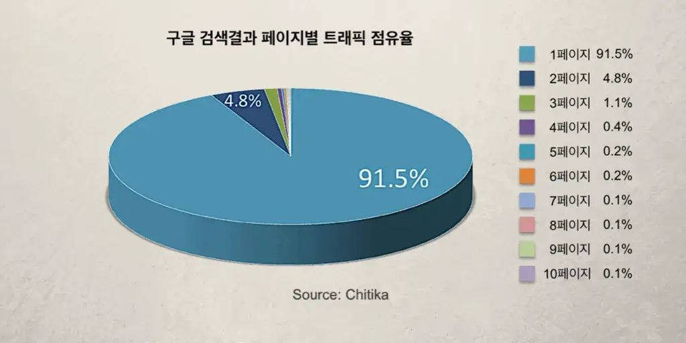

import Test from '@site/src/components/Test'

# CSR & SSR

SSR과 CSR은 HTML렌더링 방식으로 렌더링을 어디서 하는지에 따라서 SSR (Server Side Rendering) 또는 CSR (Client Side Rendering)로 구분 된다!

## 1. SSR (Server Side Rendering)
###  작동방식
서버쪽에서 렌더링 준비를 끝마친 상태로 클라이언트에 전달하는 방식

1. 웹사이트에 접속하면 서버에서 필요한 데이터를 갖고와 즉시 렌더링 가능한 HTML파일과 Javascript 코드를 클라이언트에 전달 
2. 클라이언트에 전달 되는 순간 HTML파일은 즉시 렌더링 된다
   - Javascript는 아직 안읽힘
3. Javascript코드를 다운로드하고 HTML에 Javascript 로직을 연결 
   - 다운로드 중 사용자는 컨텐츠는 볼 수있지만 페이지 조작은 할 수 없다. 

### 장점 
- CSR보다 초기 view 로딩속도가 빠르다
- 페이지에 대한 정보가 렌더링시 이미 포함되어 있기 때문에 SEO 측면에서 유리함

### 단점
- 클라이언트에서 요청시마다 페이지가 새로고침 돼 화면이 깜빡거린다.
- 사용자 클릭이 많은 서비스일 경우 클릭 마다 서버에 요청하고 위의 작동 방식을 반복 하기 때문에 서버에 부담이 크다.
- 사용자가 빠르게 화면을 확인 할 순 있지만 JS를 받지 받지 못한 상태에선 상호작용이 불가능하다.

## 2. CSR (Client Side Rendering)
###  작동방식
서버에서 HTML,JS를 전부 받아 클라이언트에서 렌더링을 시작하는 방식 

1. 클라이언트에서 서버에 요청
2. 서버에서 비어 있는 HTML파일 보내줌 
3. 다시 클라이언트에서 HTML파일에 링크된 해당 웹페이지에 필요한 모든 로직이 담겨있는 JS파일을 요청해 받는다
4. 클라이언트에서 JS파일까지 다 받아지면 그때 화면이 보여지고 상호작용도 가능하다.
   - 다운로드된 JS가 실행되고 API로 부터 데이터를 받아 오기전까지 사용자는 placeholder를 보게된다  

### 장점
- 초기 로딩은 SSR보단 느리지만 이후 구동속도는 빠르다
  * 초기 로딩시 모든 JS파일을 다운받기 때문
- data요청이 있을 때만 서버에 요청 하기 때문에 서버에 부담이 적다.
- 클라이언트에서 연산,라우팅 처리를 직접하기 때문에 반응속도가 빠르다.

### 단점 
- 사용자가 첫 화면을 보기까지 시간이 오래 걸릴 수 있다.
- 렌더링시 JS파싱, 로딩 및 실행 순서 때문에 크롤러봇이 데이터를 수집하는데 어려움이 있어 SEO 측면에서 불리하다.

## 3. SEO..??

SEO(Search Engine Optimization)는 검색엔진최적화 라고 하는것. 그러니까 구글이나 네이버 같은 검색 엔진의 검색 결과 상위에 노출되도록 웹사이트나 콘텐츠를 최적화 하는 과정이라고 한다.

 

### 그럼 SEO가 왜 중요한 걸까??

사진에서 보면 검색결과 트래픽중 91.5%가 첫페이지에 집중 되어있다. 그만큼 상위에 노출 되지 않는다면 잠재적 고객을 유치할 가능성이 적어 진다는 것!
 
생각해 보면 나도 검색 결과를 2페이지 이상으로 넘어가 본적이 없었던것 같다. 

##### 일단은 여기 까지만 작성하고 SEO관련 해서는 자세히 더 알아 본뒤 기록 해야겠다 몇시간을 앉아 있었는데 SSR CSR도 제대로 정리 못한걸 보니 집중력도, 이해력도 0에 수렴하는듯 .. 🫠 그래도 어쩌겠음 해야지.. 자책할 시간에 한가지라도 더 구겨 넣자..제발😠 