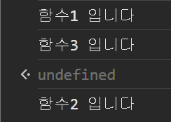

<br /><br />

## 이번 글은!

:::tip ✌️

동기 비동기 처리방식에 대해 글을 써보려고 한다! 여기저기 찾아보고 최대한 내가 이해한 대로 작성해보려고 함!! 근데 관련된 지식?으로 블럭,논블럭 이라는것도 있어서 여기에 대한것도 같이 정리하면서 작성 할것임! 먼저~ 이미지를 보면서 동기,비동기 두 방식에 대한 차이를 보면서 얼마 없는 지식에 조금이나마 보태보자👀

:::
<br /><br />

#### 역시 말로 설명하는 것 보다 눈으로 보는게 더 이해하기 쉬은듯..


<br /><br />

## 동기(synchronous) 방식


> 요청과 결과가 동시에 일어나는 방식으로 요청을 보낸 후 응답을 받아야 다음 동작이 진행된다 (작성된 순서대로 처리하는 방식)
>
> - 직렬적 방식 >> 서버로 요청을 보내면 요청에 대한 응답을 받기 전까지 다음 동작들은 진행 불가 ( 커피머신 이라고 생각하면 됨 A작업이 끝날때 까지 다른 B작업 시작 X )

- 장점 : 설계가 간단하며 직관적
- 단점 : 요청 결과가 반환되기 전까지 대기 해야함

<br /><br />

```js title='동기방식 예시 코드'
function 함수1() {
  console.log("함수1 입니다");
  함수2();
}
function 함수2() {
  console.log("함수2 입니다");
  함수3();
}
function 함수3() {
  console.log("함수3 입니다");
}
함수1();
```


위 사진을 설명하자면 보다시피 작성된 대로 출력됐다. 함수1이 실행되는 동안 다른 함수들이 작업을 수행하지 못하게 block하고 함수1의 작업이 끝나면 다음 함수가 실행 되는 것!

<br /><br />

## 비동기(Asynchronous) 방식


> 요청과 결과가 동시에 일어나지 않는 방식 (작성된 순서와 상관없이 처리)
>
> - 병렬적 방식 >> 서버에 보낸 요청에 대한 응답을 기다리지 않고 다른 요청을 서버에 보낼수 있다 ( A작업을 기다리면서 B작업 시작 O)

- 장점 : 요청에 대한 결과가 반환되기 전에 다른 작업을 수행 할 수 있어 자원을 효율적으로 사용할 수 있다.
- 단점 : 동기 방식보다 설계가 복잡하다.

<br /><br />

```js title='비동기 예시 코드'
function 함수1() {
  console.log("함수1 입니다");
  함수2();
}
function 함수2() {
  setTimeout(() => {
    console.log("함수2 입니다");
  }, 1000);

  함수3();
}
function 함수3() {
  console.log("함수3 입니다");
}
함수1();
```



이번 예시에 setTimeout이 비동기함수다!(브라우저에서 제공하는 비동기 함수) 일단 설명하기 전에 브라우저의 구성을 설명하고! 위 코드를 설명해보겠다!

:::tip

- `Call Stack` : 실행된 코드의 환경을 저장하는 자료구조, 함수 호출 시 Call Stack에 추가(push) 해줌
- `Web APIs` : DOM, AJAX, setTimeout 등 브라우저가 제공하는 API
- `Event Table` : 특정 event(timeout, click, mouse move 등등)가 발생했을 때 어떤 callback 함수가 호출되야 하는지를 알고 있는 자료구조
- `Callback Queue` : 이벤트 발생 시 실행해야 할 callback 함수가 Callback Queue에 추가 됨
- `Event Loop` : Call Stack이 비어있을 경우, Callback queue에서 함수를 꺼내 Call Stack에 추가 해주는 역할

:::

1.  **함수1**의 `console.log('함수1 입니다')` 가 `Call Stack`이라는 곳에 추가 됨(push)
2.  `console.log('함수1 입니다')` 가 화면에 출력 되고 `Call Stack`에서 제거됨
3.  **함수2**안에 `setTimeout`와 **함수3**이 `Call Stack`에 추가 됨
4.  `setTimeout`이 실행 되면서 `Browser`가 제공하는 `timer` 웹 API를 호출하고(setTimeout의 콜백 함수가 여기로 이동됐다고 생각하면 되는듯?) 그후 `setTimeout`은 `Call Stack`에서 제거 됨
5.  `setTimeout`다음에 있던 **함수3**이 실행 되면서 `console.log('함수3 입니다')`가 화면에 출력 후 `Call Stack`에서 제거
6.  `setTimeout`함수에 전달했던 1000ms 시간이 지난뒤 `setTimeout`안에 콜백함수가 `Callback Queue`라는곳에 추가 된다.
7.  `Event Loop`가 `Call Stack`이 빈것을 확인 후 `Callback Queue`를 확인해 안에 있는 콜백함수를 `Call Stack`에 추가 한다
8.  콜백함수가 실행 되고 `console.log('함수2 입니다')`가 `Call Stack`에 추가된 후 화면에 출력 된 뒤 `Call Stack`에서 제거 된다.

        - **_여기서 `setTimeout`을 0초로 실행해도 같은 결과가 나옴_**

    [참고 블로그](https://medium.com/sjk5766/javascript-%EB%B9%84%EB%8F%99%EA%B8%B0-%ED%95%B5%EC%8B%AC-event-loop-%EC%A0%95%EB%A6%AC-422eb29231a8) ⬅️이글을 보고 정리해 봤다?(라고 쓰고 거의.. 받아 적어 왔다고 읽는다) 진짜 이해하기 쉽게 작성 잘하시는 듯..👍👍👍

<br /><br />

### 정리하자면 ?..

자바스크립트는 기본적으로 동기적으로 동작 한다. 왜냐~ 자바스크립트가 싱글스레드 언어여서 한번에 하나의 프로세스를 실행 할수 있기 때문인데, 싱글스레드인데도 비동기적으로 동작가능 한것은 `setTimeout()`함수나 `fetch()`함수 처럼 비동기 동작하는 함수들 때문! 비동기로 동작하는 함수들을 메인스레가 다른곳에 작업을 맡기고 작업이 완료 되면 콜백함수를 받아 실행하면서 작업을 동시에 처리할 수 있는것임!

예를들어 서버에 요청을 보내고 데이터를 응답받아야 하는 작업을 **(빠르게 처리 되지않는 작업이라 가정 함)** 해야 하는 경우엔 동기적으로 처리하면 이 작업이 다 끝나고나서야 다음 작업을 할 수 있기 때문에 비동기적으로 요청해둔뒤 나머지 동기적으로 실행 해야하는 작업들을 **(빠르게 처리 가능한 작업들)** 처리하는게 더 효율적 이라는것!

<br /><br />

## 블로킹(Blocking), 논블로킹(Non-Blocking)

주로 코드 실행 흐름을 설명하는 데 사용되는 개념이다

-제어권: 제어권은 자신(함수)의 코드를 실행할 권리를 말한다. 제어권을 가진 함수는 자신의 코드를 끝까지 실행한 후, 자신을 호출한 함수에게 돌려준다.

### 블로킹(Blocking)

    작업이 완료될 때까지 코드가 차단 되는 상태 동기적 코드 실행이 블록 방식이라고 할 수 있음


### 논블로킹(Non-Blocking)

    작업이 완료되지 않더라도 코드가 계속 실행되는 상태 비동기적 코드 실행이 논블록 방식


