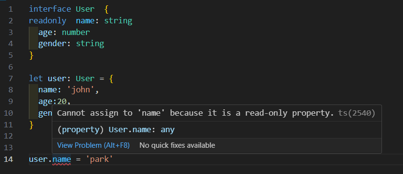

<br />
<br />

## Javascript의 역사

## 함수

### 일반 선언식

#### 익명함수

#### 기명함수

### 함수 표현식

```js
const myFunction = function () {};
```

## 비구조화 할당

### 배열

```js
const likeFoods = ["apple", "banana", "orange"];
console.log(likeFoods[0]); // apple
console.log(likeFoods[1]);
console.log(likeFoods[2]);

const [apple, banana, orange] = ["apple", "banana", "orange"];
console.log(apple); // apple
```

### 객체

```js
const person = {
  name: "john",
  age: 20,
  gender: "male",
};
console.log(person.name); // john

const { name, age, gender } = person;

console.log(name); // john
```

## 전개 연산자 (spread 연산자)

### 깊은 복사, 얕은 복사

```js title='얕은 복사'
const arr1 = [10, 20, 30];
const arr2 = arr1;

console.log(arr1 === arr2); // true

arr1.push(40); // 배열에 40추가

console.log(arr1); // [10, 20, 30, 40]
console.log(arr2); // [10, 20, 30, 40]
```

<br />

배열은 참조 자료형이고 별도의 주소값을 가지고 있기 때문에 arr1이 가지고 있는 배열의 주소값을 arr2도 가지게 됨으로 arr1, arr2는 같다.
그래서 arr1에 값을 추가하면 바라보고 있는 배열의 주소 위치가 같기 때문에 arr1, arr2 둘다 같이 바뀌게 된다.
<br />

```js title='깊은 복사'
const arr1 = [10, 20, 30];
const arr2 = [...arr1];

console.log(arr1 === arr2); // false

arr.push(40);

console.log(arr1); // [10, 20, 30, 40]
console.log(arr2); // [10, 20, 30]
```

<br />

arr2에 arr1의 배열이 전개되어서 새로운(new) 배열로 다시 탄생하기 때문에 arr2는 arr1의 배열 변수의 주소값을 가지고 있지 않는다. 따라서 arr1의 값을 변경해도 arr2는 영향을 받지 않게 되는데, 이를 깊은 복사라고 한다.

<br />
<br />

### 병합

```js title='배열'
const arr1 = [10, 20, 30];
const arr2 = [1, 2, 3];
const arr3 = [...arr1, arr2];

console.log(arr3); // [10,20,30,1,2,3]
```

```js title='객체'
const user1 = { name: "john", age: 20 };
const user2 = { name: "park", age: 21 };

const user3 = { ...user1, ...user2 };

console.log(user3.age); // 21
```

<br />

객체를 병합하는경우 키(key)가 중복이 되면 마지막 키가 덮어씌여진다.

<br />
<br />

## 타입스크립트

> JS에서 다루는 값에 타입을 부여하는 것

### 기본자료형

```ts
let str:string = "A";
let num: number = 10;
let bol: boolean = true;
let und:undefined = undefined;
let null:null = null;
let sym:symbol =symbol();
```

### 참조자료형

```ts
let arr: [] = [];
let obj: {} = {};
let fn: () => void = function () {};
```

<br />
<br />

### 객체 타입 readonly

타입에 readonly를 부여하면 그 값은 읽기전용이 되고 수정할 수 없게 된다.



### 함수 타입지정 : 매개변수와 반환값의 타입을 지정하는것

```ts
function sum(a: number, b: number): number {
  return a + b;
}

const sum2: (a: number, b: number) => number = function sum(a, b) {
  return a + b;
};

function returnString(a: number, b: number): string {
  return "A";
}
```

<br />
<br />

---

본 후기는 본 후기는 [유데미x스나이퍼팩토리] 프로젝트 캠프 : Next.js 3기 과정(B-log) 리뷰로 작성 되었습니다.
