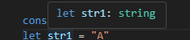

## 타입 오버레이트

타입스크립트에서 사용하는 연산자로 자바스크립트의 OR(||) 연산자와 AND(&&) 연산자와 같은 역할을 한다.

<br />

### 유니언 타입 (OR)

유니언 타입은 OR(||) 연산자와 같은 역할을 하는 타입스크립트 오퍼레이터(|)로 여러 개의 타입을 결합한 타입을 말하는데, 유니언 타입은 연결된 타입 중 1개만 만족하면 된다.

```ts title='유니언 타입'
const returnValue = (value: number | string) => value;

console.log(returnValue("1"));
console.log(returnValue(1));
```

### 유니언 타입 사용시 주의할 점

유니언 타입을 사용했을때, 그 함수 내부에서 유니온 타입의 매개변수를 하용하면 타입을 좁혀주는 과정이 필요하다.

```ts
function sum(a: number | string, b: number | string): number | void {
  if (typeof a === "number" && typeof b === "number") return a + b;
  else return console.log("매개변수가 문자열 입니다.");
}
sum(1, 2);
sum("1", "2");
```



<br />

### 인터렉션 타입 (AND)

```ts title='인터렉션 타입'
let user: { name: sting } & { age: number } = {
  name: "john",
  age: 20,
};
```

<br />
<br />

## 타입 추론

변수를 선언할 때 명시적인 타입을 지정하지 않아도 할당된 값에 따라 자동으로 타입을 유추하는 기능이다. 예를들어 `let x = 10`이면 `x`는 자동으로 number 타입으로 추론되는것. 반대로 명시적으로 타입을 지정하는것을 `타입 주석`이라고 한다.

> api응답 결과값이 아니라면 타입추론을 사용하는것도 나쁘지 않다.

<br />

## 리터럴 타입

특정값을 타입으로 사용하는 방식이다. `const`로 변수를 선언하게 되면 그 값만 사용하게 되는것 처럼 리터럴 타입으로 지정하면 다른값은 할당할 수 없다. 그래서 `const`로 변수를 선언하면 아래 사진처럼 할당한 값을 리터럴 타입으로 추론하게 된다.(객체의 경우엔 다름)


```ts
let str: "test" = "test";
```

<br />
<br />

## 타입 별칭

`type`키워드를 사용하여 타입을 지정하는 방식이다. ( 기본 타입을 지정할 때 사용)

```ts
type Point = {
  x: number;
  y: number;
};

const point: Point = {
  x: 10,
  y: 20,
};
```

<br />
<br />

## 인터페이스

객체 타입을 지정할 때 사용하는 문법

```ts
interface MyType {
  key1: value1;
  key2: value2;
}
```

```ts title='병합: 기존 인터페이스와 같은 이름에 추가해주면 됨(타입별칭은 안됨)'
interface MyUser {
  name: string;
  age: number;
}

interface MyUser {
  phone: string;
}

const newUser: MyUser = {
  name: "park",
  age: 20,
  phone: "010-1111-1111",
};
```

```ts title='상속:extends를 사용해 뒤에있는 인터페이스의 타입을 상속받음'
interface UserPhone {
  phone: string;
}

interface MyUser extends UserPhone {
  name: string;
  age: number;
}

const newUser: MyUser = {
  name: "park",
  age: 20,
  phone: "010-1111-1111",
};
```

<br />
<br />

## enum(열거형)

관련된 값들의 집합을 명명된 상수로 정의하는 방법으로 가독성을 높이고 특정값들을 명확하게 관리하는데 유용함

```ts title='숫자형 열거'
enum Direction {
  Up, // 0
  Down, // 1
  Left, // 2
  Right,
}

console.log(Direction.Up);

enum Direction {
  Up = 20, // 20
  Down, // 21
  Left, // 22
  Right,
}
console.log(Direction.Up);
```

```ts title='문자형 열거'
enum Direction {
  Up = "UP",
  Down = "DOWN",
  Left = "LEFT",
  Right = "RIGHT",
}
console.log(Direction.Up); // "UP"
```

<br />
<br />

## 제네릭

타입을 미리 지정하지 않고 사용하는 시점에 타입을 정의해서 쓸 수 있는 문법

```ts title='기본사용법'
const returnValue = <T>(arr: T[]): T => {
  return arr[0];
};
console.log(returnValue<number>([1, 2, 3]));
console.log(returnValue<string>(["A", "B", "C"]));
```

```ts title='제네릭 인터페이스'
interface Mobile<T> {
  name: string;
  color: string;
  option: T;
}

let mobile1: Mobile<string> = {
  name: "galaxy",
  color: "red",
  option: "없음",
};
let mobile2: Mobile<{ bell: string }> = {
  name: "galaxy",
  color: "red",
  option: {
    bell: "3",
  },
};

// 쉼표를 기준으로 제네릭을 추가할 수 있다.

interface Mobile<T, U> {
  name: string;
  color: string;
  option: T;
  etc: U;
}

let mobile1: Mobile<string, number> = {
  name: "galaxy",
  color: "red",
  option: "없음",
  etc: 0,
};
let mobile2: Mobile<{ bell: string }, string> = {
  name: "galaxy",
  color: "red",
  option: {
    bell: "3",
  },
  etc: "string",
};
```

<br />
<br />

---

본 후기는 본 후기는 [유데미x스나이퍼팩토리] 프로젝트 캠프 : Next.js 3기 과정(B-log) 리뷰로 작성 되었습니다.
