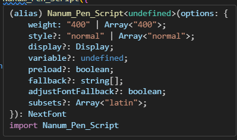

## NextJS 스타일링

1. Tailwind CSS > Next.JS 공식 팀이 권장하는 스타일링 방식
2. Module CSS > Next.JS 공식 팀이 권장하는 스타일링 방식
3. Global CSS > 일반적인 CSS 방식
4. CSS-in-JS > 추가적인 설정이 필요해 NextJS에선 추천하지 않음(사용은 가능함)

## 폰트 설정

### 구글 폰트 설정

Next.JS는 구글 폰트에서 제공하는 폰트를 지원하는 `next/font/google` 패키지를 갖고있다. 중괄호 안에 원하는 글꼴 명을 입력해주면 됨.

```tsx
import {글꼴 명} from 'next/font/google'
import {Nanum_Pen_Script} from 'next/font/google'

const nanumPenScript = Nanum_Pen_Script({
  weight: "400", // 필수 옵션
  // subsets: ["latin"],
});

export default function page() {
  return (
    <>
      <h1 className={nanumPenScript.className}>Home page</h1>
    </>
  );
}
```



<br />

### 로컬 폰트 설정

1. 폰트 파일을 저장
2. ts 파일에서 `localFont`를 import해온뒤 폰트 경로를 입력해 준다

```ts title='font.ts'
import localFont from "next/font/local";

export const jejuDoldam = localFont({
  src: [
    { path: "./local/jejudoldam.woff2" },
    { path: "./local/jejudoldam.woff" },
  ],
});
```

```ts title='page.tsx'
import Count from "@/components/count";
import { jejuDoldam, nanumPenScript } from "@/lib/fonts";

export default function page() {
  return (
    <>
      <h1 className={nanumPenScript.className}>Home page</h1>
      <h2 className={jejuDoldam.className}>font test</h2>
      <Count />
    </>
  );
}
```

<br />
<br />

## 이미지 넣기

- `<Image />`컴포넌트를 사용해야함 `next/image`
- width, height를 필수로 넣어줘야 하고, 만약 사용하지 않고 부모요소의 크기에 맞추려면 fill 프로퍼티를 사용하면 된다.(부모요소는 relative, fixed, absolute중 하나여야함 )

<br />

## 라우팅, 라우터, 라우트

### 라우팅

사용자가 요청한 URL에 따라 어떤 페이지를 보여줄지 결정하는 과정 Next.JS는 앱 라우팅 / 페이지 라우팅을 사용해 URL경로와 페이지 파일을 직접 연결 한다.

### 라우터

라우팅을 관리하고 처리하는 기능을 제공하는 도구로 사용자의 URL을 해석하고 해당 URL에 맞는 컴포넌트를 렌더링 한다.

- 페이지 라우터 : `next/router` (13버전까지)
- 앱 라우터 : `next/navigation` (14버전 부터)

```tsx
import { useRouter } from "next/navigation"; // 앱 라우팅
import { useRouter } from "next/router"; // 페이지 라우팅

export default function About() {
  const router = useRouter();
  return <div>about page</div>;
}
```

### 라우트

라우트는 URL과 특정 컴포넌트 간의 매핑을 나타낸다. 일반적으로 페이지의 경로와 해당 경로에 표시할 컴포넌트를 정의하는데 사용됨.

<br />
<br />

## 앱 라우팅

  <details>
    <summary>기본 라우팅</summary>

    ```md

app/
├── blog/
│ └── page.tsx --- /blog
├── about/
│ └── page.tsx --- /about

````

  </details>


  <details>
    <summary>중첩 라우팅</summary>

  특정 폴더 안에 새로운 폴더를 중첩하는 형태로 중첩 경로 지정이 가능함

    ```md

app/
└── blog/
    ├── page.tsx - /blog
    └── first/
        └── -page.tsx -- /blog/first

````

  </details>
  
  
<details>
<summary>다이나믹 라우팅</summary>

동적(dynamic) 경로를 사용하면 특정 세그먼트가 동적으로 변경되는 경로를 지정할 수 있다. 이때 동적 경로로 지정한 `page.tsx`에선 Props로 url의 `params`와 `searchParams`를 받을 수 있다.

```bash title='app > blog > [id]'

app/
└── blog/
    ├── page.tsx - /blog
    └── [id]/
        └── page.tsx -- /blog/1 or /blog/2 or /blog/3...

/detail/123?order=false는
props로 { params: { id: '123' }, searchParams: { order: 'false' } }
```

만약 `/blog/detail/123?order=false`에 접근한다면

```tsx title='/blog/detail/[id]/page.tsx'
import DetailDesc from "@/components/detail-desc";

interface Props {
  params: { id: string };
  searchParams: { order: string };
}

export default function DetailPage({ params, searchParams }: Props) {
  return (
    <div>
      <p>{params.id}</p>
      <p>{searchParams.order}</p>
      <DetailDesc />
    </div>
  );
}
```

위 코드에서 params : 123 , searchParams.order : false로 출력 되게 된다.

  </details>

<details>
<summary>그룹 </summary>

앱라우터는 폴더를 생성하는 즉시 라우트 경로에 반영 되는데, 소괄호로 생성한 폴더 안에 넣어두게 되면 소괄호는 경로에 인식 되지 않는다. 만약 페이지가 엄청 많은 상황이라면 경로가 될 폴더들이 많아지게 되는데, 이렇게 그룹화 하게 되면 가독성을 높힐수 있다.

```bash
app
├── (home)   --> /home은 경로에 포함 안됨.
│    └── page.tsx --- /
├── (auth)
    └──login
    │   └── page.tsx --- /login
    └──register
        └──  page.tsx --- /register

```

  </details>

  <details>
  <summary>프라이빗 폴더</summary>

폴더에 언더스코어를 붙이면 라우팅을 통해 접근할 수 없다.

```bash
app
  └── __utils >> 폴더명 앞에 언더바 2개
        page.tsx - 접근 불가
        form-date.ts
```

  </details>

### 다이나믹 경로와 쿼리 받는 방법

#### 서버 컴포넌트

컴포넌트의 Props를 통해 동적 세그먼트와 쿼리스트링을 받을 수 있음

#### 클라이언트 컴포넌트

useParams(), useSearchParams() 훅을 사용해 받을 수 있다

<br />
<br />

## 시스템 파일

- page.tsx : 라우트 경로로 지정된 페이지 (경로 폴더 안에 생성)
- layout.tsx : 각 라우트 경로마다 지정할 수 있으며 공통된 레이아웃을 처리해주는 페이지
- not-found.tsx : 페이지를 찾을 수 없을 때 보이는 페이지로 가장 최상위 경로에 생성해주면 해당 경로가 없을때 not-found.tsx페이지를 보여준다. 또 경로 파일에도 생성 가능한데 경로에서 만든 not-found페이지를 보여주려면 해당경로의 page.tsx에서 `notFound()` 함수를 사용해줘야한다.
- error.tsx : 컴포넌트에서 에러가 발생했을 때 사용자에게 보여주는 페이지. (클라이언트 컴포넌트여야함) 자신의 라우트 경로와 가장 가까이 있는 error.tsx컴포넌트를 우선 렌더링 한다.

```bash title='error.tsx 예시'
app/
├── blog/
│   ├── page.tsx
│   └── error.tsx --- /blog 페이지에서 에러 발생할 경우 우선 로딩
├── auth/
│   └── login/
│       └── page.tsx --- /auth/login 에서 에러 발생할 경우 같은 경로에 error.tsx 없어서 루트 경로의 error.tsx 로딩
└── error.tsx --- 각 라우트에서 error.tsx를 찾지 못하면 최종적으로 루트 경로의 error.tsx

```

<br />
<br />

## 메타 데이터

메타데이터는 layout.tsx페이지에 설정해주는게 좋다.

### 동적 페이지 metadata 설정하기

`generateMetadata`를 사용해서 동적 페이지에서의 메타데이터를 설정 할 수있다. 자동으로 props가 들어가게 되는데 나같은 경우엔 동적경로 폴더를 `[id]`로 만들어줬기 때문에 `params에` {id: string} 형식으로 들어오게 된다.

```tsx title='/blog/[id]/layout.tsx
export function generateMetadata({
  params,
}: {
  params: { id: "seoul" | "london" | "paris" | "newyork" };
}) {
  console.log("🚀 ~ params:", params);
  return {
    title: params.id,
  };
}
```

### 메타데이터 title 공통 처리하기 (정적 페이지)

```ts title="root layout.tsx
export const metadata = {
  title: {
    template: "%s | Sucoding", // %s 에 다른 컴포넌트에서 지정한 문자열이 들어가게 됨
    default: "Next.JS 14 | Sucoding", // 루트에서 보여지게될 title
  },
  description: "Let's learn next.js",
};
```

> 동적페이지의 metadata는 %s가 적용되지 않으므로 직접 적용 시켜줘야 한다

<br />
<br />
---

본 후기는 본 후기는 [유데미x스나이퍼팩토리] 프로젝트 캠프 : Next.js 3기 과정(B-log) 리뷰로 작성 되었습니다.
