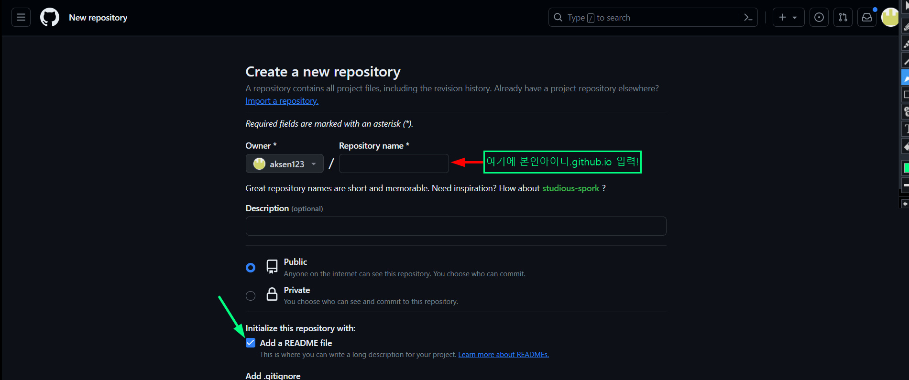
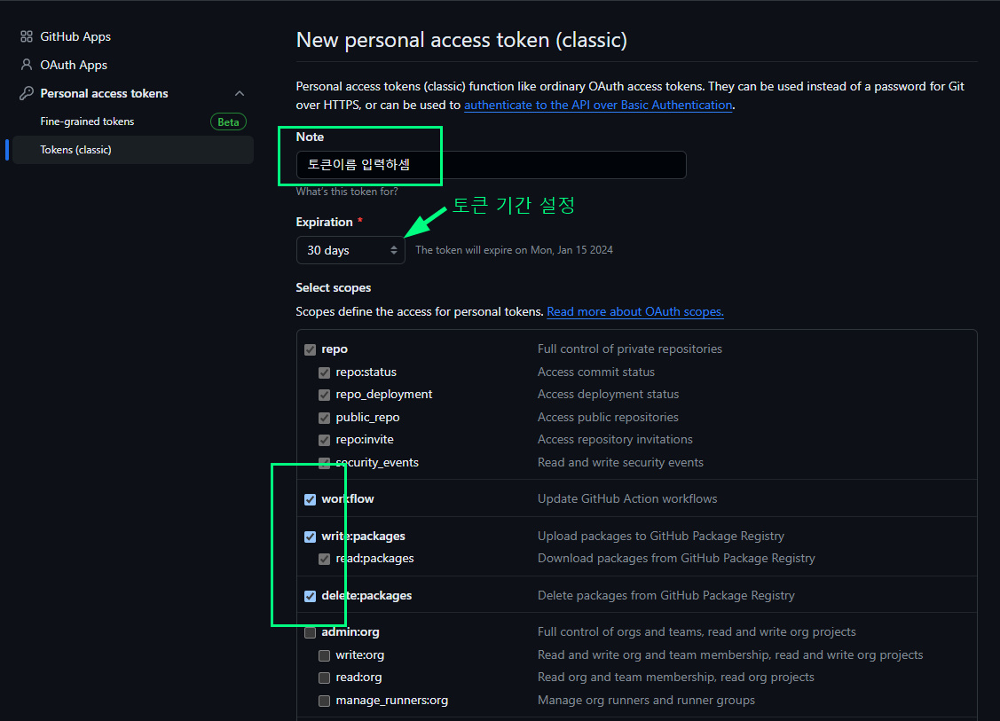
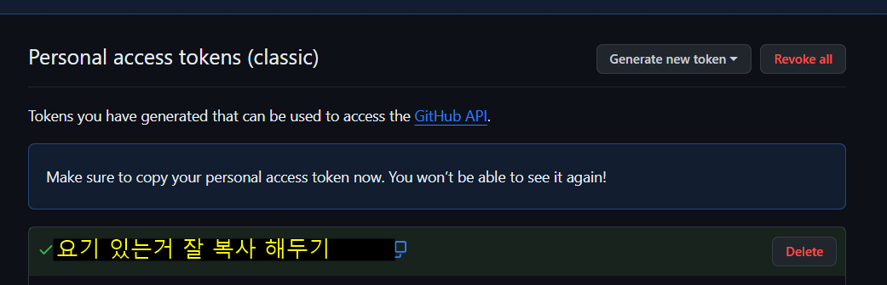
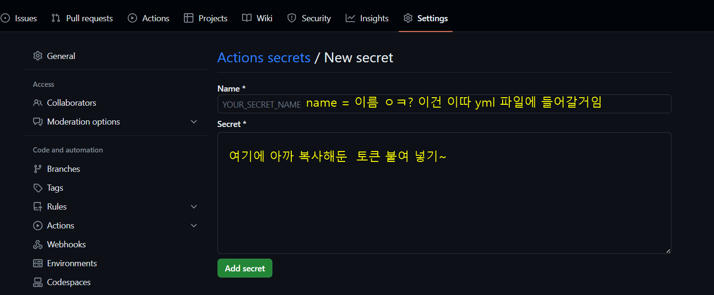

<br />
<br />
<br />
- ## github repository 만들기
<br />

> **깃헙 배포전 일단 repository를 만들어야 하는데 repository이름은 `userName.github.io`로 만들어 줘야한다(✔️public, Add a README file 체크 해주기)**



이런식으로 만들어 주면 된다! 

<br />
 ## docusaurus.config.js 설정 해주기!

> 소개 및 사용법 글에도 작성 했지만 배포하려면 docusaurus.config.js 파일 설정을 해줘야 한다.<br /> [docusaurus 공식문서](https://docusaurus.io/ko/docs/api/docusaurus-config)

```js
export default {
  title: 'Docusaurus', // 웹사이트 타이틀
  url: 'https://userName.github.io', // userName엔 본인 깃헙 아이디 입력!
  baseUrl: '/', // repository 이름 이력! (사이트의 Base URL 설정)
  favicon: '/img/favicon.ico', // 사이트 파비콘 경로 입력!
  organizationName: 'user name', // 본인 깃헙 아이디 입력!
  projectName: 'repository name', // repository 이름 이력!
  
  themeConfig: {
    image: 'img/docusaurus-social-card.jpg', // 오픈그래프 경로
    navbar: { //네비게이션 바 설정 
      title: 'My Site', // 메인 메뉴 타이틀
      logo: {
        alt: 'My Site Logo', 
        src: 'img/logo.svg',// 타이틀 이미지
      }
    }
  }
};
```
<br />
<br />
<br />

- ### 이렇게 설정하고 github에 push를 하면 ??
github pages를 통해 자동으로 배포 되는줄 알았다.. 이렇게 하고 `https://아이디.github.io/`에 들어가 보니 README.md 파일 내용만 보였다..!! 그래서 여기저기 찾아 보고 고민해 봤다


:::tip 🤔

아 맞다 build를 안했넹 build된 파일만 따로 올려야 하나? <br />
그럼 메인 브랜치엔 build전 파일들 올리고 다른 브랜치를 만들어 build된 파일들만 올려야하나?

:::
그래서 해당 repository에가서 setting > pages 에 가서 Build and deployment의 branch 설정을 해당 브랜치로 설정한뒤 다시 해보니 제대로 나오긴 나왔다!! 
        

그런데 이렇게 하면 블로그 글을 수정하고 추가할때 메인브랜치에서 build전 파일들 push하고 build된 파일만 넣는 브랜치로 바꿔서 pull한뒤 build 해서 다시 build폴더만 push 해야하는 건가?? 너무 핵귀찮 아닌지 ..? 라는 생각이 들었다 (당연히 더 좋은 방법이 있겠지만 나로서는 이생각 밖에 안들었음 바보..☆🫠)

한참 생각하다 이런 상황을 친구한테 말했다. 그런데 친구는 git으로 push만 하면 배포까지 된다는걸 듣고 친구 블로그와 깃헙을 다시 보고 검색하면서 이게 듣기만 했던 CI/CD라는 것을 알게? 됐다!! 이것과 관련한 글은 다음에 다시 작성 해야지.. 아무튼 !! 그래서 더 찾아 git push만 하면 github action을 통해 자동으로 배포까지 되게끔 만들었는데

## 어떻게 했냐면
<br />
<br />

- ### Build and Deployment 설정해주기

  위 사진처럼 `해당 repository > setting > pages`에 가서 build파일만 들어갈 브랜치를 루트로 설정 해준다! (사진은 위에 있으니 생략)
<br />
<br />

- ### github 토큰 발급 생성하기
github 메인 페이지에서 본인 프로필? 이미지 누르면 setting이있다.
<br />
`프로필이미지 > setting > Developer Settings > Personal access tokens > Tokens `
<br />
에 들어가서 Generate new token을 누르자! 누르면 비밀번호를 입력하라고 뜨는데 비밀 번호를 입력하면!



이렇게 이름이랑 기간 아래 세가지를 체크한뒤 생성 하면 되는데!!

> **생성된 토큰은 한번만 노출되니 바로 복사해서 소중한곳에 보관해두자**



<br />
<br />
<br />

- ### 해당 repository에 토큰을 등록하자

이제 다시 `해당 repository > setting > Secrets ans variables`를 누르면 그아래 메뉴에 action이 있을 거임 그것을 누른뒤 화면에 초록색 버튼으로 `New repository secret`이 있는데 이걸 누르면!


<br />
__위에 사진 처럼 작성후 만들어주면 아래처럼 등록이 돼 있을 것임!! ✌️__
<br />


<br />
<br />

- ### 프로젝트 파일에 yml파일을 만들자!
:::tip ✏️

이부분은 아직 제대로 몰라서 CI/CD를 제대로 공부하고 다시 작성할 계획이다🐥 

:::

**일단 해당 프로젝트 루트 폴더에 `.github/workflows`폴더를 만들어 준다! 그리고 그안에 deploy.yml 파일을 생성!**
일단 내가 친구 깃헙, 구글링 등으로 이해?한부분을 작성 해보겠다. 코드는 그냥 복사해옴..
```js title='.github/workflow/deploy.yml'
name: Deploy to GitHub Pages

on:
  push:
    branches:
      - main  // main 브랜치로 push할때만 작동? 한다
jobs:
  deploy:
    name: Deploy to GitHub Pages
    runs-on: ubuntu-latest
    steps:
      - uses: actions/checkout@v3
      - uses: actions/setup-node@v3
        with:
          node-version: '18.x' // 본인 노드 버전 작성해줘야함 
          cache: npm

      - name: Install dependencies
        run: npm ci
      - name: Build website
        run: npm run build

      - name: Release to GitHub Pages
        uses: peaceiris/actions-gh-pages@v3
        with:
          github_token: ${{ secrets.BLOG_TOKEN }} //여기다 아까 repository에 등록해둔 토큰 이름을 적어 줘야함 
          publish_dir: ./build
```
<br />
<br />
<br />
### 이렇게 해주고 위 코드에 브랜치명으로 push해주면..!!

