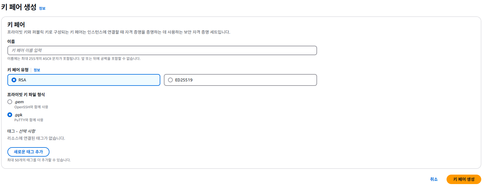

# 🐳 Docker 네트워크 실습 정리

:::tip
이 문서는 AWS EC2 Ubuntu 서버를 활용하여 Docker 네트워크와 관련된 다양한 실습을 수행한 내용을 정리한 것이다.
:::

## ⚙️ 실습 환경 구성

:::tip
본 실습에서는 AWS의 CloudFormation을 활용하여 EC2, VPC, 보안 그룹, Docker 등 실습에 필요한 환경을 자동으로 구성했다.

경보님이 제공해주신 템플릿 링크를 활용하면, 복잡한 설정 없이도 실습에 필요한 인프라가 자동으로 만들어짐.
:::

### 필요한 실습 구성

- VPC 1개 (퍼블릭 서브넷 2개)
- EC2 인스턴스 1대 (Ubuntu 22.04, t3.small)

### 🔐키 페어 생성

**EC2 > 네트워크 및 보안 > 키 페어 > 키 페어 생성**  
파일 형식을 .pme으로 설정하고 키페어를 생성하면 파일을 다운받을수 있게 된다.



### 🧾 CloudFormation 실행 방법 (콘솔 기준)

1. AWS Console > CloudFormation > 스택 생성
2. 템플릿 지정 > 템플릿 소스 > Amazon S3 URL > 제공해 주신 URL 넣기 > 다음
3. 스택 세부정보 지정 파라미터 입력:
   - `KeyName`: 내 키페어 이름
   - `SgIngressSshCidr`: 내 공인 IP 주소 + `/32`
   - (선택) `MyInstanceType`: 인스턴스 타입(t3.small 등)
4. 이후 계속 다음다음 누르고 생성
5. 스택 생성 완료 후 EC2 인스턴스에서 SSH 접속

```bash
ssh -i ~/.ssh/my-key.pem ubuntu@<EC2 퍼블릭 IP>
```

※ 별도로 서버 설정이나 도커 설치를 직접 할 필요 없이, 템플릿 실행만으로 완전한 실습 환경이 준비된다.  
단, 템플릿 실행 전에는 SSH 키페어 생성 및 현재 IP 주소 확인이 필요함.

## ✅ Docker 설치 및 기본 설정

위 실습환경 구성처럼 자동으로 설치 되면 할 필요는없지만 어쨋든 알고는 있어야 할듯해서 작성해둠.

```bash
sudo apt update
sudo apt install -y docker.io
sudo systemctl start docker
sudo systemctl enable docker
sudo usermod -aG docker $USER
newgrp docker  # 또는 SSH 재접속
```

---

## 🧠 리눅스 프로세스 정보 확인

리눅스 환경에서 프로세스를 조회, 추적, 모니터링하는 기본 명령어 특히 Docker나 서버 환경에서 어떤 프로세스가 실행 중인지, 어떤 사용자가 실행했는지 등을 확인하는 데 매우 유용하다.

### 📌 주요 명령어

|  명령어  | 설명                                                                             |
| :------: | -------------------------------------------------------------------------------- |
|    ps    | 현재 사용자 세션에서 실행 중인 프로세스 목록 출력                                |
|  ps -ef  | 전체 시스템의 모든 프로세스를 상세히 출력 (PID, 사용자, CPU/메모리 사용 등 포함) |
| top -d 1 | 실시간으로 프로세스 정보를 모니터링 (1초 간격 업데이트)                          |
|   htop   | top의 개선판, 인터랙티브 UI 제공 (설치 필요)                                     |
|  pgrep   | 이름 또는 사용자 기준으로 특정 프로세스의 PID를 찾는 명령                        |

---

## 🌐 Docker 네트워크 모드 정복하기

### 📦 네트워크 모드 종류 및 확인

```bash
docker network ls
docker info | grep Network
```

도커는 다음과 같은 네트워크 모드를 지원한다:

| 모드    | 설명                                          |
| ------- | --------------------------------------------- |
| Bridge  | 기본값. `docker0` 브리지 네트워크를 사용      |
| Host    | 호스트 네트워크를 그대로 사용                 |
| None    | 네트워크를 아예 비활성화                      |
| Overlay | 다중 호스트 네트워크 구성을 위한 모드         |
| Macvlan | 물리적 NIC와 같은 네트워크 구성이 필요한 경우 |
| IPvlan  | 네트워크 정책 제어에 특화                     |

### 🔌 Bridge 모드 실습

```bash
docker run -it --name=kn --rm busybox
ip addr

docker run -it --name=ou --rm busybox
ip addr

# ping 테스트
ping -c 4 172.17.0.X
```

### 🛰 외부 통신 확인

```bash
sudo tcpdump -i any icmp
ping -c 1 8.8.8.8
```

---

## 🛠 Host & None 모드 실습

### 🏠 Host 모드

```bash
docker run --rm -d --network host --name my_nginx nginx
docker inspect my_nginx
curl -s localhost | grep -o '<title>.*</title>'
```

같은 포트를 사용하는 컨테이너는 중복 실행되지 않음!

### 🚫 None 모드

```bash
docker run --rm -d --network none --name my_nginx nginx
docker exec -it my_nginx /bin/bash
ip addr
```

네트워크 없음. 내부에서 ping이나 curl 불가.

---

## Docker 컨테이너 보안

### 👤 Root vs Non-root 컨테이너

#### ✅ root 유저로 실행

```bash
mkdir ~/non-root && cd ~/non-root

cat << EOF >> hello.sh
#!/bin/sh
echo "Hello from multi-architecture Docker image!"
EOF
chmod +x hello.sh

cat << EOF >> root-dockerfile
FROM ubuntu
COPY hello.sh /hello.sh
CMD ["/hello.sh"]
EOF

# 빌드 및 실행
docker build -t root -f root-dockerfile .
docker run -it root /bin/bash

# 컨테이너 내부에서 확인
whoami
id
apt update -y && apt install nginx -y
```

#### ✅ non-root 유저로 실행

```bash
cat << EOF >> non-root-dockerfile
FROM ubuntu
RUN useradd -m -u 1001 appuser
USER appuser
COPY hello.sh /home/appuser/hello.sh
EOF

# 빌드 및 실행
docker build -t non-root -f non-root-dockerfile .
docker run -it non-root /bin/bash

# 컨테이너 내부에서 확인
whoami
id
apt update -y
```

> 보안을 강화하려면 컨테이너를 가능한 non-root 사용자로 실행하는 것이 권장된다.

> root로 실행된 컨테이너는 외부 침투 시 리스크가 큼

---

### 🔐 Docker 클라이언트 인증 (OPA)

Docker 명령어를 아무나 수행할 수 없도록 인증 단계 추가 - OPA

#### OPA Plugin 활성화 실습

```bash
docker plugin ls

# 정책 디렉토리 생성
sudo mkdir -p /etc/docker/policies
sudo touch /etc/docker/policies/authz.rego

# 모든 사용자에게 모두 허용
echo "package docker.authz
allow = true" | sudo tee -a /etc/docker/policies/authz.rego

# Docker Plugin Install - OPA (수락 필요)
sudo docker plugin install openpolicyagent/opa-docker-authz-v2:0.4 opa-args="-policy-file /opa/policies/authz.rego"

# Docker Daemon 설정
if [ ! -f /etc/docker/daemon.json ]; then
  sudo touch /etc/docker/daemon.json
fi
echo "{
  \"authorization-plugins\": [\"openpolicyagent/opa-docker-authz-v2:0.4\"]
}" | sudo tee -a /etc/docker/daemon.json

# 설정 확인
cat /etc/docker/daemon.json

# 플러그인 활성화 적용
sudo systemctl restart docker

# 정책 변경 (모두 사용 불가)
sudo vim /etc/docker/policies/authz.rego
# 내용 수정: allow = false

# Docker 명령어 수행 테스트
docker ps
```

---
