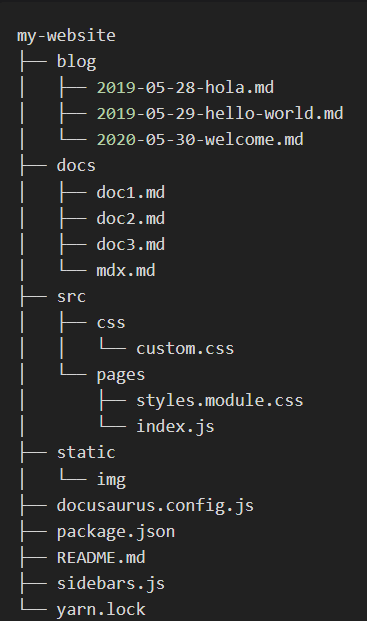
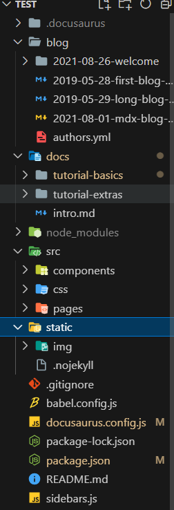
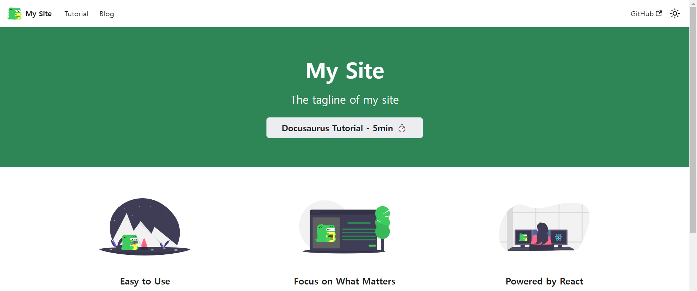
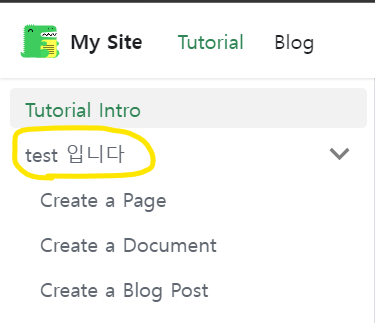
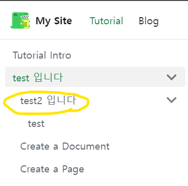
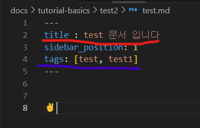
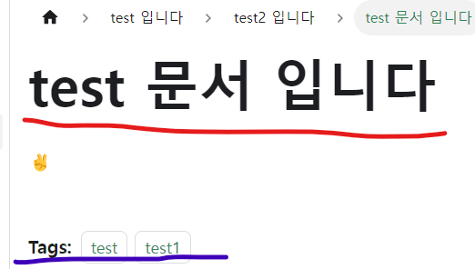

> 블로그를 무엇으로 시작할지 고민하던 중 친구의 추천으로 docusaurus를 사용해 깃허브 블로그를 시작하게 됐다. 블로그 배포 까지 완료한 내용을 정리해서 작성 해보려고 함

## 0. Docusaurus란?

**[Docusaurus](https://docusaurus.io/ko/blog/2017/12/14/introducing-docusaurus)** 는 Facebook에서 개발한 오픈 소스 프로젝트 문서화 툴이다. 간단히 말하면 문서화를 쉽게 만들어 주는 도구로 Markdown뿐 아니라 MDX형식으로 문서 내에 JSX와 리액트로 동적인 컴포넌트를 작성 할 수 있다.

## 1. 설치 및 설정

### 설치

```cmd
npx create-docusaurus@latest my-website classic
```

터미널에 넣어 주면 되는데 <br />
my-website는 루트폴더 이름을 작성해주면 되고 뒤에 있는 classic은 템플릿이라고 하니까 그냥 넣어주는게 좋을듯?? 그리고 나중에 익숙해지면 사용자 지정 템플릿도 반영할 수도 있다는데 ..일단 익숙해져 보자
아 그리고 typescript도 사용 할수 있는데 설치 코드뒤에 **--typescript**를 넣어주면 됨!

### 프로젝트 구조

classic 템플릿을 선택하고 설치하면 루트폴더 아래에 이런식으로 파일들이 생성된게 보인다.




- /blog/ : 블로그 형식의 마크다운를 저장하는 디렉토리
- /docs/ : 기본적인 마크다운 문서를 저장하는 디렉토리 (사이드바에 나타나는 디렉토리의 순서는 `_category_.json`파일에서 설정 할수 있다)

- /src/ : 페이지 설정이나 리액트 컴포넌트의 기능 및 스타일링을 커스터마이징할 수 있는 소스 디렉토리이다.
- /static/ : 정적인 파일이 위치되는 곳으로, 이곳에 있는 파일들은 빌드시에 build 디렉토리로 복사된다.
- /docusaurus.config.js : 기본 틀에 대한 설정을 하는 곳으로, 사이트 이름과 favicon, navbar와 footer 등 기본 틀을 설정하는 파일이다. 또, 배포를 위한 설정하는 부분도 있다.

- sidebars.js : Docusaurus 프로젝트에서 사용되는 사이드바(Sidebar) 구성을 정의하는 파일 이라고 하는데 이건 잘 모르겠다 파일을 들어가 보면 거의다 주석처리 돼있음..

암튼 이렇게 생성한 디렉토리로 이동후 _npm start_ 명령어로 로컬에서 실행하게 되면 이런 화면이 보이게 된다 (아마도 이게 classic 템플릿인듯..?)


### 설정하기

#### docs > _category_.json(폴더 설정파일) 설정

```json
{
  "label": "카테고리 폴더이름", //폴더 이름 설정 할수있음
  "position": 1 // 폴더배치 순서
  //이것 말고도 다른 것들이 있는데 그건 나중에 알아보기로 ..
}
```

예를 들어 `"label" : "test 입니다"` 라고 작성하면 이런식으로 이름이 바뀌는 식이다.

참고로 이 폴더에 하위 폴더를 만들면 하위 메뉴가 만들어 짐(하위 폴더도 카테고리 파일을 만들어서 세팅 해줘야함) <br />



#### md, mdx 문서 설정

문서를 작성 할때 문서 제일 위에서 문서를 셋팅 할수있다! (사진 처럼 --- 사이에 작성 해줘야함)

```
---
title : 문서제목  // 문서 제목
sidebar_position: 6 // 배치 순서
tags: [태그명, 태그명] // 태그명
---
```




#### docusaurus.config.js 설정

**[공식 문서는 여기서](https://docusaurus.io/ko/docs/configuration)**

```js
module.exports = {
  title: 'My Documentation', // 문서 웹사이트 제목
  tagline: 'A sample Docusaurus documentation', // 부가 설명
  url: 'https://example.com', // 웹사이트의 기본 URL
  baseUrl: '/my-docs/', // 문서가 호스팅되는 기본 경로 (repository 이름 입력)
  organizationName: 'user name' // 깃헙 아이디
  onBrokenLinks: 'throw', // 링크가 깨졌을 때 동작 설정
  onDuplicateRoutes: 'warn', // 중복된 경로가 발견되었을 때 동작 설정

  themeConfig: {
    navbar: {
      title: 'My Documentation', // 네비게이션 바에 표시되는 제목
      // ... 다른 네비게이션 바 설정
    },
    sidebar: {
      // ... 사이드바 설정
    },
    // ... 다른 테마 구성 옵션
  },

  plugins: [
    // ... 플러그인 설정
  ],

  customFields: {
    // ... 사용자 정의 필드 설정
  },

  presets: [
    // ... 미리 정의된 설정 사용
  ],
};
```

<br />
<br />
<br />
<br />
<br />

> 내일은 github pages, action 등 배포관련해서 막혔던 부분에 대해서 쓰고 다른 공부도 좀 해야겠다!! 아직은 글을 쓰고 정리하는게 많이 어색하지만.. 계속 쓰다보면 나아지겠지✌️
