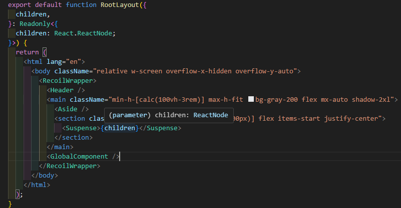
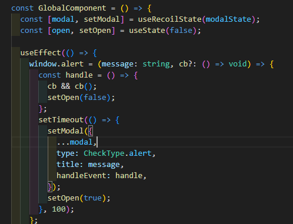
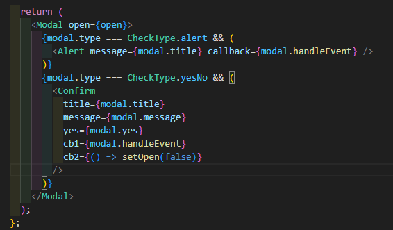
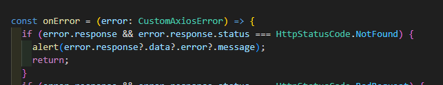
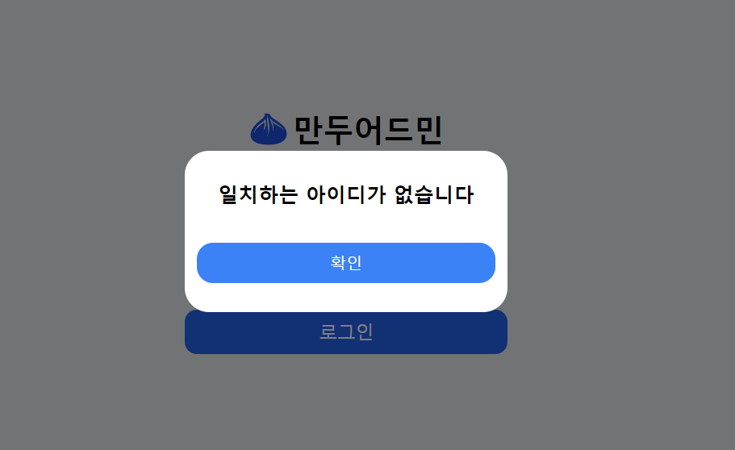
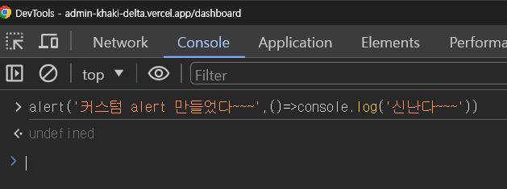
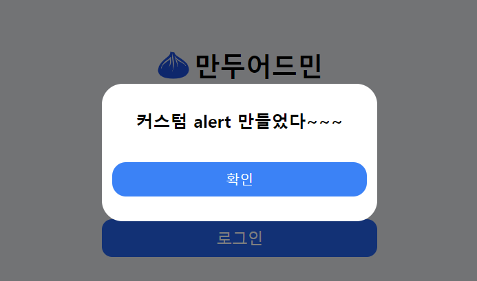
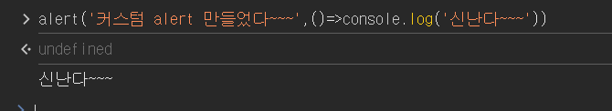

## alert 재정의 해서 커스텀 alert창 띄우기

:::tip ✏️
저번에 작성한 `react-portal`로 모달 띄우는 글에 이어서 오늘은 window 객체의 alert함수를 재정의 해서 alert 호출시 내가 만든 컴포넌트가 대신 뜨게 하는 방법에 대해서 작성할 것이다. 이전글은 아래 링크에서 확인!

[portal로 모달띄우기](/docs/공책/Portal.md)
:::

## 시작은! alert 함수 재정의 하는것 부터!

일단 alert를 재정의 해줘야 하는데 `d.ts` 파일을 만들어서 함수를 재정의 해주고 `tsconfig.json` 파일의 `include`에 `**/*.d.ts`를 추가해 준다! (있으면 안해줘도 됨)

```ts title=".d.ts"
// 기존에 선언된 window.alert에 대한 타입 확장
declare global {
  interface Window {
    alert: (message: string, callback?: () => void) => void;
  }
}
```

<br />

## layout에 넣어줄 GlobalComponent를 생성해준다

> 나는 아래 사진처럼 layout 컴포넌트에 GlobalComponent를 넣어 줬다. <br />
> 맨처음 페이지가 로드될 때 GlobalComponent의 useEffect 안에서 window.alert함수를 재정의하고, 모달을 위한 DOM 노드(root)를 생성하는 작업을 앱이 시작될 때 수행 할 수 있기 때문이다!

| layout.tsx                   | GlobalComponent.tsx           |
| ---------------------------- | ----------------------------- |
|  |  |

#### 의존성 배열은 빈배열로 두고 처음 마운트 될때만 실행되게 해줬다

```tsx title='globalComponent의 useEffect안에서 root 만드는 방법'
const root = document.createElement("div");
root.setAttribute("id", "modal");
document.body.appendChild(root);
```

### modal , open

> - `open` : open은 모달 창을 띄우고 없얼때 사용하는것! setter함수를 콜백으로 넣어줬다!
> - `modal` : 여기서 Recoil로 관리하는 modal은 커스텀한 컴포넌트에 넣어줄 Props들이다! 아래 사진처럼 필요한 props들을 넣어주는건데 `AtomType.type`에따라 원하는 컴포넌트가 뜨게끔 만들어 줬음!
>   <br />

```ts title='atom.ts'
import { atom } from "recoil";

export enum CheckType {
  alert = "alert",
  yesNo = "yesNo",
}

export interface AtomType {
  type: CheckType;
  title: string;
  message: string;
  yes: string;
  handleEvent?: () => void;
}
const modal: AtomType = {
  type: CheckType.alert,
  title: "",
  message: "",
  yes: "확인",
  handleEvent: undefined,
};

export const modalState = atom({
  key: "modalState",
  default: modal,
});
```

GlobalComponent

| 

## 이제 호출을 해보자!

> 내가 만든 admin 페이지의 로그인 api중 아이디가 없을때 띄울 메세지인데 axios interceptor를 사용해서 아래 메세지를 alert으로 나오게 했다

```ts
if (getUser.empty) {
  return Response.json(
    {
      success: false,
      error: { message: "일치하는 아이디가 없습니다" },
    },
    { status: 404 }
  );
}
```



  <br />

### 로그인 페이지에서 없는 아이디를 입력하면!



> 이런식으로 내가 만든 컴포넌트에 에러 메세지 까지 띄워지는걸 볼수 있다!

### 콘솔창에서도 호출 가능

|  |  |  |

alert창의 확인을 누르면 이렇게 콜백으로 넣어준 함수까지 다 되는걸 확인 할 수 있다!✌️

> 이렇게 alert 함수를 재정의해서 내가 커스텀한 alert창을 띄우는 것에 대해 작성해봤따! 전부터 alert은 어떻게 바꿀수 없나 .. 생각하던 차에 친구가(선생님께서)이렇게도 할 수 있다는 걸 알려줘서 해봤는데 매우 만족스럽고 .....좋구만 이렇게 해서 kiosk,admin에서 사용하고있는데 아주 유용하게 잘 쓰고있다!!
