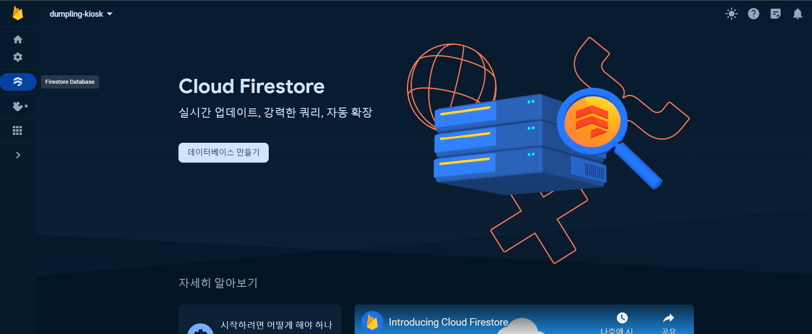
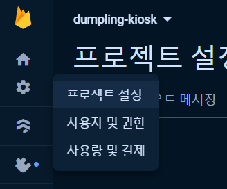

:::tip 🫡
지금 진행중인 만두 키오스크, 관리자 페이지에서 사용중인 Firestore database, storage 에 관련해서 글 작성할것임 뭔가 사진으로 보면 더 이해하기 쉬워했던 나를 위해 .. 사진위주로 작성해보겠다! 일단!! 하루만에 다쓸 욕심은 버리고.. 천천히... 천천히 완성해 나가자.. ✌️
:::

## 먼저 데이터 베이스를 만들자~

#### 1. Firebase 프로젝트가 없다면 `Firebase Console`에서 프로젝트 추가를 클릭한 후 화면에 표시된 안내를 따라 Firebase 프로젝트를 만들어준다! 만들어진 프로젝트를 선택하면 아래같은 화면이 나옴!

#### 2. 아래 사진에 있는 메뉴를 클릭하면 저 화면이 나오는데 저기서 데이터 베이스를 만들어 주면 된다!

#### 3. 만들기 버튼 누르면 보이는 화면! 사진을 보면 알겠지만 위치설정 하는것은 나중에 변경할 수 없다니까 호다닥 눌러서 넘어가려 하지말고 서울로 바꿔준뒤 넘어가자~

#### 4. 보안규칙을 설정해야하는데 여기선 아래 테스트 모드에서 시작을 선택! 하고 만들기를 눌러주면! 데이터베이스 만들기 끝!!

#### 5. 데이터 베이스 완성!

> 아래 사진은 프로젝트에서 사용중인 데이터 베이스인다 일단! foods엔 메뉴들, orders엔 주문 내역들, payment에는 결제 내역들을 저장하고 있음! (결제는 못함ㅎ..ㅎ)
> 

## 데이터베이스 연결, 초기화!

- 요기에 들어와서~

  

- 아래롤 내려오면 내 앱이라는게 있는데 여기에서 내가 지금 만들고있는 프로젝트를 연결해주면 된다 ! 나는 웹앱이니까 세번째 메뉴를 클릭!
  
