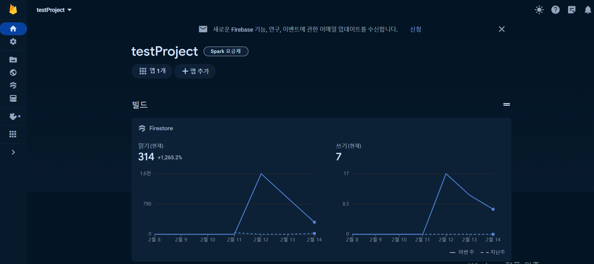
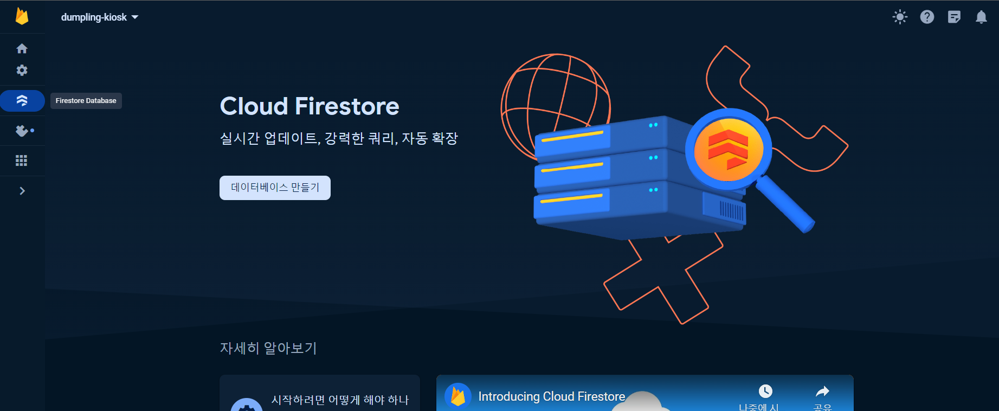
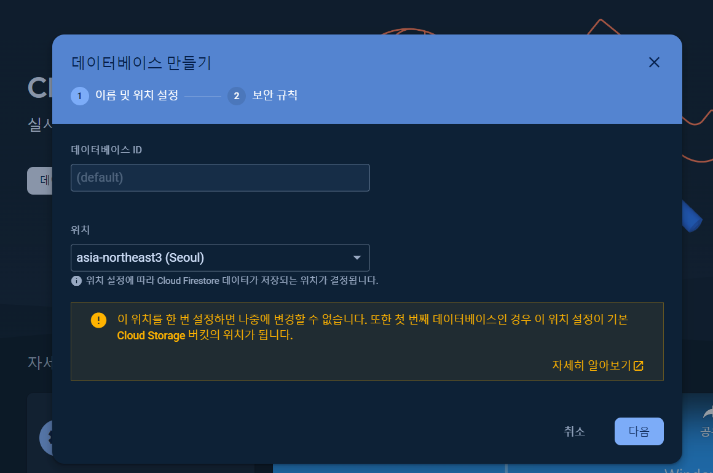
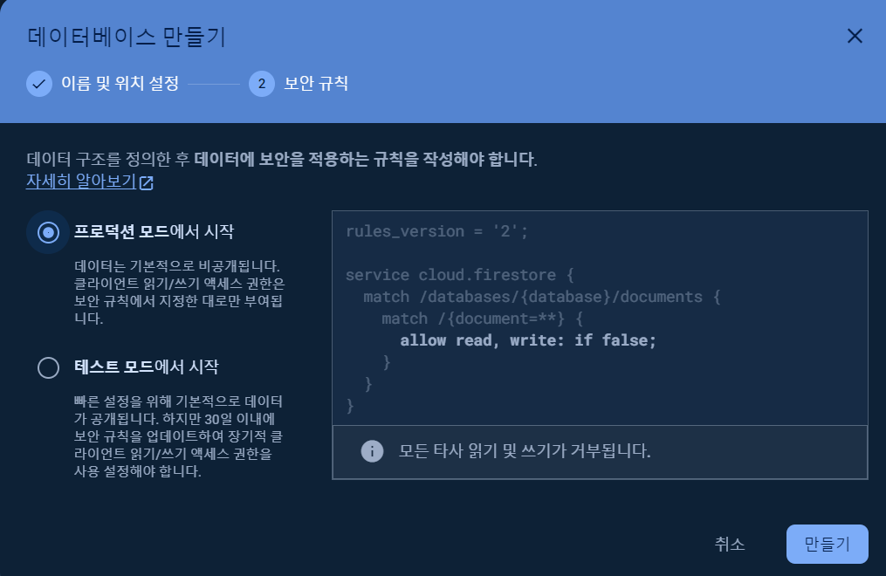
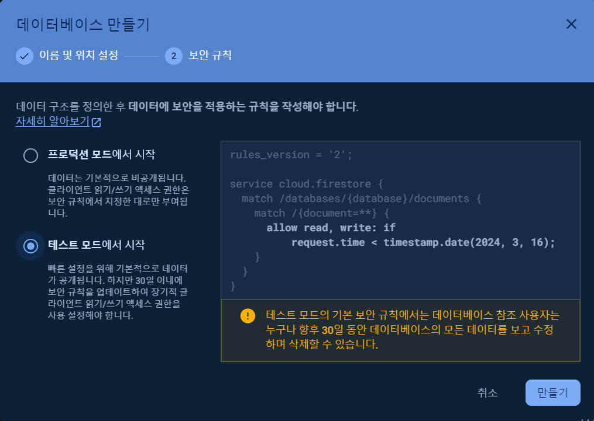
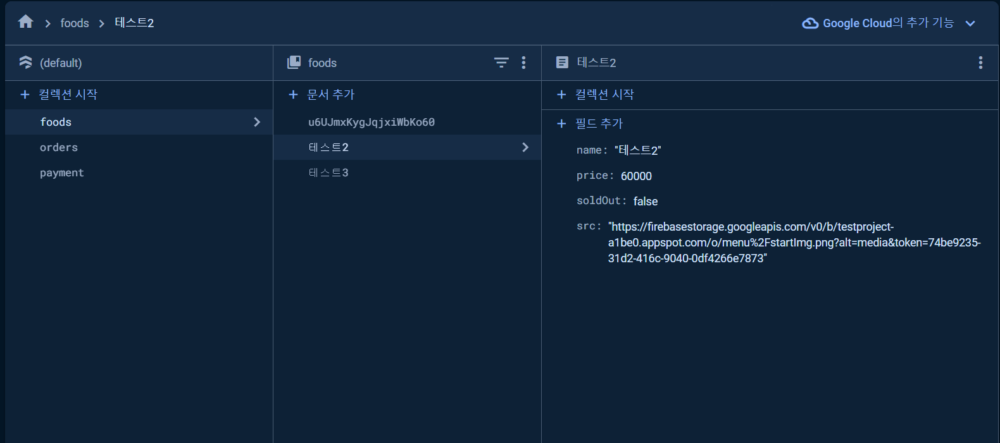
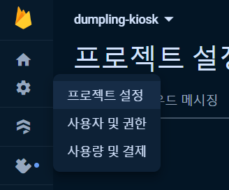
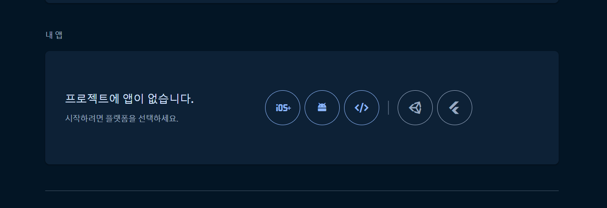
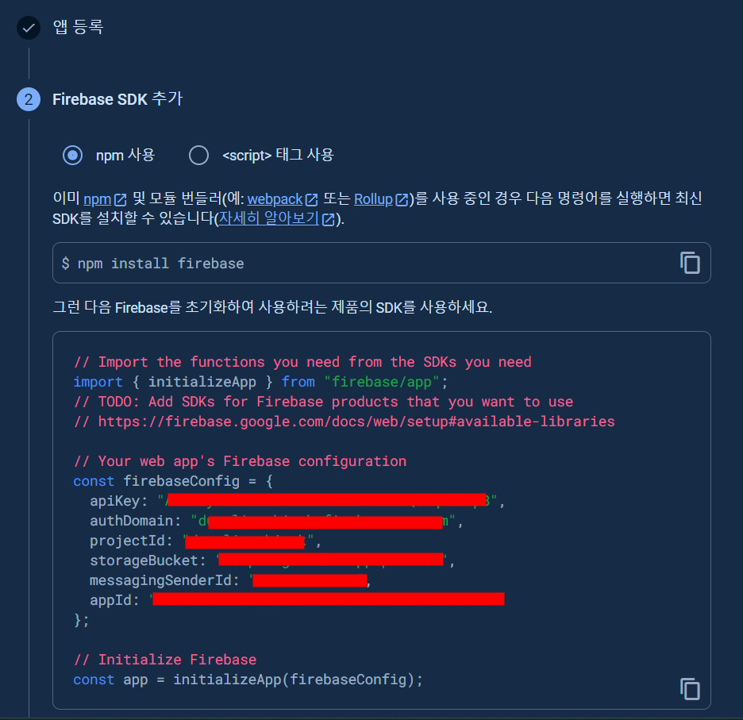

:::tip 🫡
지금 진행중인 만두 키오스크, 관리자 페이지에서 사용중인 Firestore database, storage 에 관련해서 작성할꺼다 먼저 설치, 데이터베이스 만들고 연결하는것 까지만 작성해야지!
:::

## 먼저 데이터 베이스를 만들자~

#### 1. Firebase 프로젝트가 없다면 `Firebase Console`에서 프로젝트 추가를 클릭한 후 화면에 표시된 안내를 따라 Firebase 프로젝트를 만들어준다! 만들어진 프로젝트를 선택하면 아래같은 화면이 나옴!



#### 2. 아래 사진에 있는 메뉴를 클릭하면 저 화면이 나오는데 저기서 데이터 베이스를 만들어 주면 된다!



#### 3. 만들기 버튼 누르면 보이는 화면! 사진을 보면 알겠지만 위치설정 하는것은 나중에 변경할 수 없다니까 호다닥 눌러서 넘어가려 하지말고 서울로 바꿔준뒤 넘어가자~



#### 4. 보안규칙을 설정해야하는데 여기선 아래 테스트 모드에서 시작을 선택! 하고 만들기를 눌러주면! 데이터베이스 만들기 끝!!




#### 5. 데이터 베이스 완성!

> 아래 사진은 프로젝트에서 사용중인 데이터 베이스인다 일단! foods엔 메뉴들, orders엔 주문 내역들, payment에는 결제 내역들을 저장하고 있음! (결제는 못함ㅎ..ㅎ)
> 

## 데이터베이스 연결, 초기화!

- 요기에 들어와서~

  

- 아래롤 내려오면 내 앱이라는게 있는데 여기에서 내가 지금 만들고있는 프로젝트를 연결해주면 된다 ! 나는 웹앱이니까 세번째 메뉴를 클릭!
  

- 위의 메뉴를 누르면 앱을 등록하는 화면이 나오는데 닉네임 정해주고 SDK를 등록해줘야하는데! 나같은 경우엔 아래 코드를 복사해서 firebase.ts폴더에 셋팅을 해줬음! (앱정보는 환경변수로 저장해서 넣었다!)
  

- 설치하기! (SDK를 추가하기전에 먼저 설치 해줘야함)

```js
npm install firebase --save
```

```ts title='firebase.ts'
import { initializeApp } from "firebase/app";
import { getFirestore } from "firebase/firestore";
const firebaseConfig = {
  apiKey: process.env.NEXT_PUBLIC_API_KEY,
  authDomain: process.env.NEXT_PUBLIC_AUTH_DOMAIN,
  projectId: process.env.NEXT_PUBLIC_PROJECT_ID,
  storageBucket: process.env.NEXT_PUBLIC_STORAGE_BUCKET,
  messagingSenderId: process.env.NEXT_PUBLIC_MESSAGING_SENDER_ID,
  appId: process.env.NEXT_PUBLIC_APP_ID,
};

const app = initializeApp(firebaseConfig);

const db = getFirestore(app);

export default db;
```
