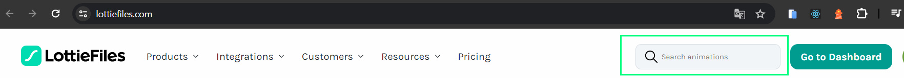
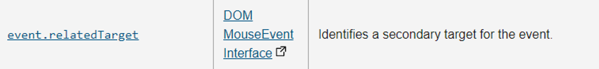
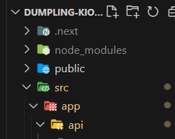

## 오늘은~

지금 작업중인 프로젝트에서(dumpling-kiosk) 서버에서 데이터를 받아 올때 로딩 애니메이션을 넣으려고 알아보다 Lottie라는것을 알게 돼서 적용 해봤다. 적용 하는데 큰 어려움?은 없었고 앞으로도 애니메이션을 써야할땐 lottie를 자주 쓸거같다 일단 !!!

Lottie는 Airbnb가 만든 오픈소스 라이브러리로, JSON 기반의 애니메이션 파일이다. 이미지 파일에 비해 용량이 작고 웹이나 앱 어디서든 작동한다 또, 크기를 자유롭게 조정해도 해상도가 낮아지지 않는다는 장점이 있다!

[LottieFiles 페이지](https://lottiefiles.com/kr/what-is-lottie)

## 사용법!

### 설치 방법

일단 늘 그렇듯 설치를 먼저 해주면 되는데 아래 처럼 입력해 설치해 주시고~

```
  npm install --save react-lottie-player
```

<br /><br />

### 사용하고 싶은 애니메이션 저장하기

[LottieFiles](https://lottiefiles.com/kr/) 요기에 가서~ 간단히 가입해주고 !


<br /><br />


저기 검색창에 검색후! 맘에드는 애니메이션의 json파일을 저장해주면 된다! (일단 나는 가난한 취준생이기 때문에 free한 애들로만 다운받았음.)

<br /><br />

### 이제 적용 시켜야지 ?

설치도 했고 마음에 드는 애니메이션도 저장했으면 이제 내 프로젝트에 적용 시켜야 한다! 일단 애니메이션 컴포넌트를 만들고! 이렇게 둘다 import해온다.

```tsx
import Lottie from "react-lottie-player";
import loading from "@/../public/loading.json";  << 아까 다운받은 애니메이션
```

> 아 여기서 json파일 경로가 왜 저모양이냐면 나는 파일을 public에 넣어놔서 `/public/loading.json` 이렇게 하면 경로를 읽을줄 알았는데 못읽어 와서 `../../../public/loading.json`으로 하니까 읽어 왔다 근데 보다시피 좀.. 그런 느낌이라 알아보다가 친구(선생님)한테 물어 봤더니 뙇 보더니 저렇게 하면 된다네 ..? 선생님 설명은
>
>  <br />
> 폴더구조가 이렇게 돼 있는데 여기서 @가 src를 가르키고 있다고 했다 그러니 public으로 가려면 저렇게 작성을 해줘야 한다~ 이말임! 기억해 두기!

<br /><br />

암튼 이상태에서! 아래처럼 넣어주면 해당 애니메이션을 적용 시킬수 있다는것!

```tsx
export default function Example() {
  return (
    <Lottie
      loop
      animationData={loading}
      play
      style={{ width: 150, height: 150 }}
    />
  );
}
```

## 마무리

오늘은 프로젝트에 적용한 Lottie에 대해서 작성해 봤다. 일단 생각했던 것보다 너무 쉽게? 쓸 수 있어서 이게 맞나 싶긴 했는데! 맞겠지..? 이렇게 작성해두는 건 나중에 다시 쓸 때를 위해 기록해 두는 거니까 .. 일단은 이렇게만 작성해두고.. 커스텀 해서 사용 가능하다고 하는데 그거에 대해서는 좀 더 공부를 하고 기록을 해 둬야겠다. 왜냐 오늘은 정말 저렇게 적용하기만 하고 끝이었기 때문에..🫠🫠 그럼 오늘은 여기까지..!! 내일은 프로젝트에서 사용한 react portal에 대해서 정리해야겠다 그럼 20000
