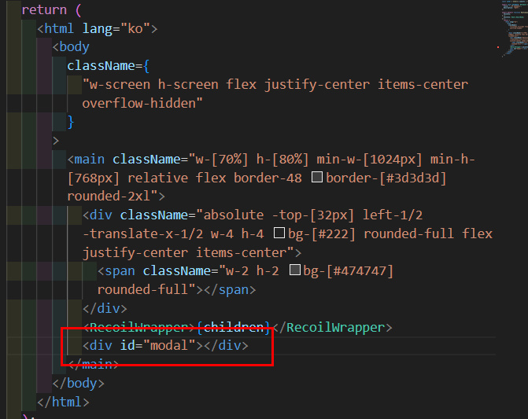
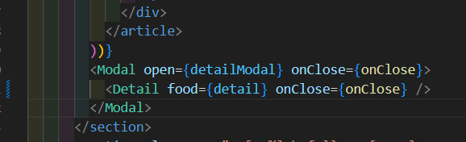
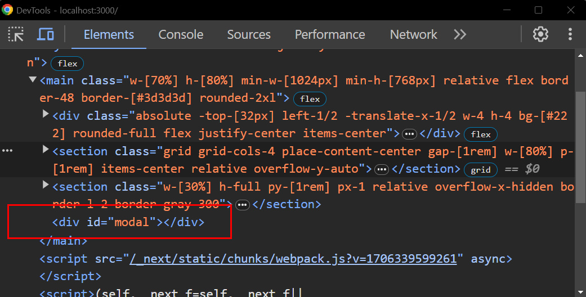
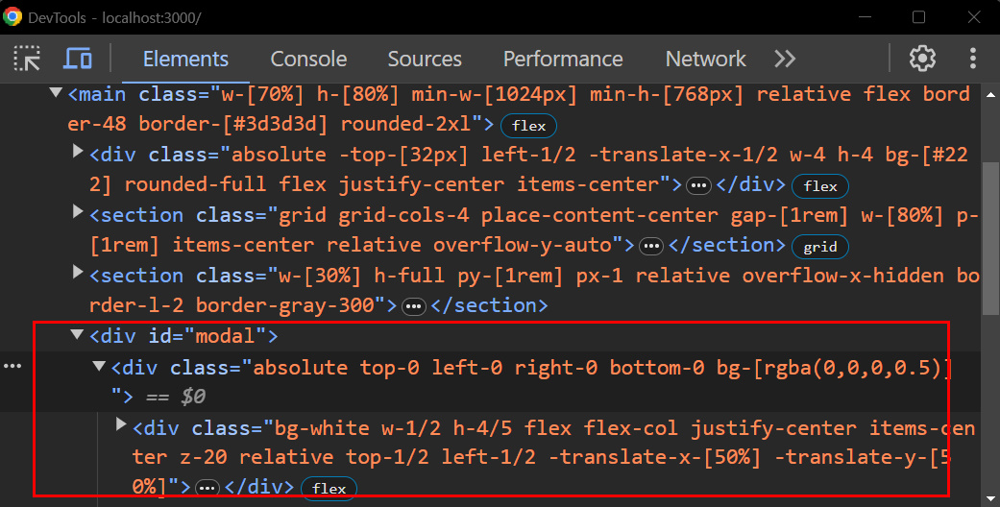

## Portal로 모달 띄우기

> 만두 키오스크를 만들던 중 메뉴 디테일, 결제 컴포넌트 등을 모달로 띄우는 방식으로 만들었는데 친구(선생님)가 기존방식 말고 portal을 사용해서 만들어 보라고 했고 혹시 알고있냐는 질문에 역시나 빈곤지식인인 나는 모른다고 답해줬다✌️ 그래서 오늘은~ 기존 모달방식 말고 새롭게 적용해본 portal에 대해서 작성 해보겠다!

<br /><br />

### Portal 장점

React Portal은 컴포넌트를 현재 트리구조에서 독립적으로 렌더링할 수 있게 하는 방식이다. 이것으로 DOM의 특정위치에 컴포넌트를 렌더링할 수 있는데! 음.. 게임 portal이라고 생각 해도 될듯! 일단 장점을 몇가지 적어보자면

1. DOM 계층 구조 외부에 렌더링: 특정 컴포넌트를 기존 DOM계층 구조 외부에 렌더링할 수 있다! 예를들어 전역적인 메세지팝업, 모달 같은 컴포넌트를 만들때 유용함

2. 스타일링과 레이아웃 제어: 기존 컴퍼넌트의 스타일링이나 레이아웃에 영향을 미치지않고 독립적으로 스타이을 지정할 수 있다! (전체 페이지에 영향을 미치지 않으면서 디자인을 일관되게 유지 가능)

3. 이벤트 버블링 제어: 모달이나 팝업 창 내에서 발생한 이벤트가 부모 컴포넌트까지 전파되는 것을 방지할 수있다.

4. 포탈 재사용성: 다양한 부분에서 재사용할 수 있는 컴포넌트를 만들 수 있다. (모달을 여러 페이지에서 사용할 때 코드를 중복 작성 하지 않고 재사용)

<br /><br />

## 사용방법!

### 모달을 띄우고싶은 곳에 `root`를 만들어 준다.



### `root`에 넣을 모달을 만들어준다!

```tsx title='modal.tsx'
"use client";
import ReactDOM from "react-dom";

interface ModalProps {
  open: boolean;
  onClose: () => void;
  children: React.ReactNode;
}

const Modal = ({ open, onClose, children }: ModalProps) => {
  const root = document.querySelector("#modal"); // << 아까 만들어둔 root

  if (!open) return null; // open 이 false면 null

  return ReactDOM.createPortal(
    <>
      <div
        onClick={onClose}
        className="absolute top-0 left-0 right-0 bottom-0 bg-[rgba(0,0,0,0.5)]"
      >
        {children}
      </div>
    </>,
    root as HTMLElement
  );
};

export default Modal;
```

이렇게 ReactDOM.createPortal에 매개변수가 두개 들어가는

1. 화면에 보여질 요소 (노드)
2. 포인터 - 모달이 띄워질 위치 (아까 만들어둔 `root`를 넣어 주면 된다 이렇게 하면 `root`에 모달 컴포넌트가 뜨게 되는것!)

나는 여기서 Modal 컴포넌트에 그냥 백그라운드만 만들었고 나머지는 children으로 들어오는 요소들을 꾸며서 띄웠음

<br /><br />

### 모달 띄우기



#### 위 사진처럼 `body > main > section`에서 `section`에 모달 컴포넌트를 띄워도 실제로 모달이 뜨면!




#### 이렇게 `section`에 뜨는게 아니라 `main`에 모달이 띄워지는걸 볼 수 있따!

## 끝!

> 이렇게 portal을 활용해 모달창을 띄워봤다! 시작전엔 어려울까 좀 쫄았는데 해보니 기존에 사용하던것 보단 더 간단한 방법인거 같다. 역시 새로운 것들은 안써 봐서 어색한거지 써보면 그렇게 어려운건 아닌듯..?(아닌가..?) 기본적으로 portal쓰는 법은 좀 적응 한것 같고 이제 다음 글은 alert,confirm 창을 overriding해서 커스텀 모달 띄우는걸 정리해서 올려 봐야지! 오늘 여기까지~🫡
