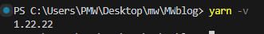
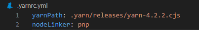
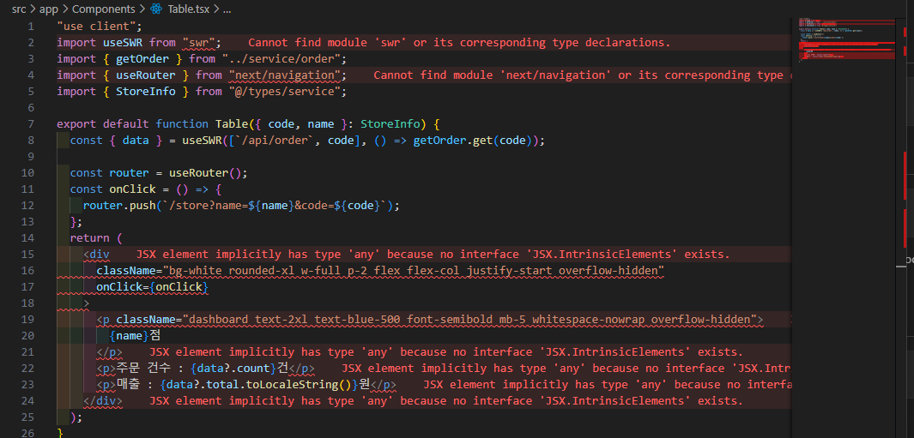
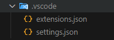
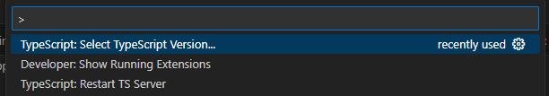
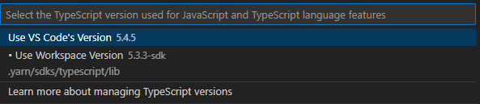

:::tip ✏️

yarn 사용법에 대해 적어두는 페이지!
아 그리고 yarn을 사용하다 생긴 오류들 해결? 한것들도 같이 기록! 암튼 yarn 관련은 싹다 여기에 !!!

시작하기 전에 yarn에 대해 간단히 설명하자면 npm을 대신할 수 있는 도구로 npm보다 더 빠르고 효율적인 캐시 시스템과 부가 기능을 제공한다고 한다! 이전에 모든 프로젝트들은 다 npm으로 사용했는데 (키오스크도) 어드민 페이지를 만들면서 yarn도 써봐야겠다 싶어서 사용해 봤다!👀
:::

## yarn 설치하기!

```
 npm install -g yarn
```

## 버전 확인

```
yarn -v
yarn --version
```



## 프로젝트 생성하기

```
yarn create next-app --typescript
```

## yarn 버전 세팅

```
yarn set version berry
```

프로젝트 루트 폴더에 가서 위 명령어를 입력하면 `.yarn`디렉토리와 `.yarnrc.yml`파일이 생성 된다.
또 프로젝트 생성시 node_modules폴더가 설치 되는데 이것도 삭제 해주면 된다! (터미널에 `rm -rf node_modules`입력! 아님 걍 삭제)

## yarnrc.yml파일에서 nodeLinker:pnp 추가



## yarn 재설치 하기

```
yarn install
```

위 명령어를 입력하면 package.json 파일 및 해당 종속성에 나열된 모든 모듈을 설치해준다!

## 모듈 추가하기

```
yarn add <모듈 이름>
```

## 모듈 제거

```
yarn remove <모듈 이름>
```

## 타입스크립트 사용하기!

최근 관리자 페이지를 만들다 기존에 작업하던 폴더에서 `yarn dev`를 실행 하면 자꾸 에러가 나서(아직도 원인은 못찾음 내 노트북이 문제 인듯..? 내친구 노트북에선 잘만됨..) 새로운 폴더에 `git clone`후 `yarn install`로 모듈들을 다 설치하고 tsx파일을 봤는데!

이런식으로 아주 피를 철철 흘리고 있었다! 왜그런가 하고 찾아봤는데 yarn으로 타입스크립트를 사용하려면 아래 방식대로 해줘야 함! 처음 프로젝트를 만들때도!

1. VSCode 확장 프로그램 ZipFS 설치

2. yarn dlx @yarnpkg/sdks vscode 를 실행하면 아래처럼 .vscode 폴더안에 파일들이 생성 된다!

   - 

3. 그 후 ctrl + shift + p 누른뒤 select typescript version을 선택 후 아래의 use workspace version을 선택해 주면! 치료 완료!

   - 
   - 

~~부끄럽지만 기존에 작업하던 폴더는 친구(선생님)이 세팅을 거의다? 해준거라서..ㅋㅋㅋ자만스럽게 아 쉽구만?이란 생각에 기록해두지 않았다 ..🫠~~
