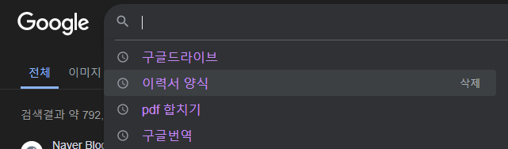

:::tip ❗
Kiosk, Admin페이지를 배포하고 이력서 등을 작성하다 생각이 들었다.
둘 다 첫 페이지에서 DB에 저장 된 지점코드, 아이디/비밀번호 를 입력 해야 다음 페이지로 넘어 가기 때문에 DB에 있는 아이디, 지점 코드를 input 태그가 포커스 됐을때 보여 주고싶었다. 간단한 기능이라 여기에 작성 할 일은 없을꺼라 생각했는데. 코드를 작성하다 새롭게 알게 된 것들도 있고 해서 작성을 해보려고 한다 ✌️
:::

## onFocus, onBlur

HTML 요소의 포커싱 관련 이벤트다! 보통 `대화형 요소`에 추가 할 수있고 `비대화형 요소`에 추가하려면 몇가지 속성을 더 부여한뒤 추가할 수 있다.

- input요소가 포커스 됐을때 발생하는 이벤트 : onFocus
- input요소에서 포커스 아웃 됐을때 발생하는 이벤트 : onBlur

## HTML 포커스 가능한 요소!

HTML엔 포커싱 가능한 요소들이 있는데 a, button, details, input, select, textarea 의 6개 요소가 포커싱 가능한 요소들로 `대화형 요소`라고 부르며 6개 요소를 제외한 나머지 요소들을 `비대화형 요소` 라고 부른다!
그런데 페이지를 작성하다 보면 div 박스나 다른 `비대화형 요소`에 포커스를 주고싶을때가 있는데 이때 이것을 가능하게 해준는게 있음!!

### tabIndex

tabIndex란 브라우저 화면에서 Tab키를 누르면 순서대로 화면 내 대화형 요소들이 순서대로 포커싱 되면서 넘어가는 모습을 볼 수 있는데, 이 순서를 부여하는 속성이 바로 tabIndex다!
비대화형 요소에 `tabIndex`속성을 추가해주면 비대화형 요소에도 포커싱이 가능하다 `tabIndex`은 어떻게 주는가 ~

```html
<div tabindex="1">A</div>
<div tabindex="3">B</div>
<div tabindex="2">C</div>
```

이런식으로 속성을 추가해줄수 있다! Tab을 세번 누른다고 한다면 `A > C > B`순서로 포커싱이 되고! div에도 onFocus, onBlur등 포커스 이벤트를 추가할 수 있다!

## 이런식으로 보여주려 했음



이런식으로 input태그가 포커스 되면 DB에 있는 아이디를 불러와 표시 되게 해주려고 했었다!
그런데 기본적으로 input태그에 자동 완성 기능이 있어서 input이 포커스 될때 이전에 입력했던 내용들이 나오게 되는 문제가 있었는데!

### autocomplete='off'

input 태그에 `autocomplete` 속성을 추가해서 자동완성기능을 꺼주면 이전에 입력했었던 내용들은 안뜨게 됨!

### input에는 onFocus, onBlur 아이디엔 onClick

input 태그에는 포커스 이벤트를 넣어주고 input이 포커스 됐을때 아이디 리스트를 보여주고 아이디를 클릭하면 input에 클릭한 아이디가 들어가게 만들었다! 간단하게 아이디엔 onClick이벤트를 넣었는데!

이상하게 아이디를 클릭해도 input value가 바뀌지 않았다! 콘솔도 찍어보고 했는데 onClick이벤트가 실행이 안되는 것이였음! 그래서 찾아 보다 알게 된것이 onBlur이벤트가 onClick이벤트보다 먼저 실행 되기 때문이였던것!

그러니까~ onblur이벤트엔 아이디 리스트를 숨겨주는 state함수를 넣어줬는데 이게 onClick이벤트보다 먼저 실행되기 때문에 아이디를 클릭하지 않은게 된 것이였다!!!

<br />

### 그래서 onClick 대신 onMouseDown으로 변경!

`onMouseDown`이벤트는 마우스를 클릭할때 (클릭 - 마우스가 아래로 눌렸다 올라오는것?..이라고 쓰겠음) 마우스가 아래로 눌렸을때 먼저 실행 되기 때문에 `onBlur`보다 먼저 실행 되는것 같았다!
그래서 기존 코드에서 li태그의 onClick이벤트를 onMouseDown이벤트로 바꿔주니 내가 원하는대로 input 포커스 시엔 아이디 리스트를 보여주고, input포커스 아웃 또는 아이디 클릭시 아이디 리스트를 숨겨 주게끔 코드를 완성할 수 있었다!

그리고 추가적으로 알게 된게 있는데 그건 아래에!

## relatedTarget ( 보조 대상 식별 )

onBlur이벤트가 발생 할 때 인자로 받는 event객체의 안을 보면 relatedTarget이라는게 담겨있다.


**간략하게 설명 해보자면 포커싱 된 HTML요소가 사용자의 마우스 클릭 등에 의해 포커싱이 해제 될때 그 다음으로 포커싱 될 HTML요소가 relatedTarget에 담겨지는것이다!**

```jsx
<input name='id' onblur='onblur()'/>
<input name='pw'/>
<div> 여긴 클릭 해도 콘솔에 안뜸 </div>
<div tabIndex="-1"> 여긴 클릭 하면 콘솔에 뜸 </div>
const onBlur = (event: React.FocusEvent<HTMLInputElement>) => {
	console.log("현재 타겟",event.currentTarget)
	console.log("클릭된 타겟",event.relatedTarget)
}
```

위 코드로 예를 들자면 id input에 포커스 된 상태에서 pw input을 클릭하게 되면 콘솔창엔 차례대로 id input과 pw input이 출력 될것임!

당연히 id input이 포커스 된 상태에서 div tabindex를 부여하지 않은 박스를 클릭하면 relatedTarget은 null이 담겨질 것임 그런데 tabIndex를 부여한 div를 클릭하면 relatedTarget에 담겨지게 된다!

<br/>

### ADMIN 로그인 페이지에 적용 한다면 ???

기존에 li 태그(아이디)에 onMouseDown이벤트를 추가해서 개발한 방식이 아니라
위 방법을 쓴다면 li태그엔 tabIndex만 추가해주고 id input엔 onBlur이벤트만 추가해서 li 요소 클릭시 해당요소 안의 textContent를 id input에 추가하는 방법으로 수정 할 수도 있겠다는 생각을 해봤다.

**음.. 뭐가 더 괜찮은 방법인지는 모르겠지만.. 일단 새로운 방법에 대해 알게 됐으니.. 여기에 이렇게 기록해 본다 ..**

  <!-- 여기까지쓰고 나머지는 내일작성 -->
