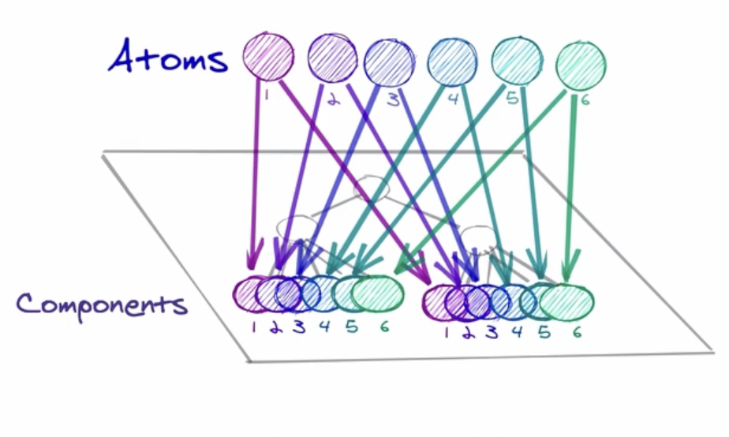

<br />

:::tip 👍

오늘은 Recoil에 대해 기록하려고 한다. <br />
전역 상태관리는 개인 포트폴리오에 적용한 redux밖에 없었고 recoil은 국비 학원에 다닐 당시 잠깐 스치듯 배운?적은 있는데.. 이름만 알고 있는 정도였고🤔.. 해서!!! 이전 프로젝트 리뉴얼을 하는김에 다른 상태관리 라이브러리를 써보는 것도 좋겠다 생각해서 recoil을 써보려고 함!!(redux도 다시 복습 해봐야 할듯..)

:::

  <br />
  <br />
## Recoil..??
> recoil은 **전역 상태관리 라이브러리**중 하나로, 다른 라이브러리(Redux, Mobx)와는 달리 React전용이며 React에 최적화 된 라이브러리다. recoil을 예제를 하면서 느낀점은 redux에 비해 초기 설정이 간편하다??
아래는 공식 사이트에서 갖고온 글이다!
>    >  Recoil을 사용하면 atoms (공유 상태)에서 selectors (순수 함수)를 거쳐 React 컴포넌트로 내려가는 data-flow graph를 만들 수 있다. Atoms는 컴포넌트가 구독할 수 있는 상태의 단위다. Selectors는 atoms 상태 값을 동기 또는 비동기 방식을 통해 변환한다.
__[Recoil 공식 페이지](https://recoiljs.org/ko/)__


  <br />
  <br />

### 설치를 해보자
```cmd
npm install recoil
```
터미널에 입력 해주면 설치 끝! 

### 기본설정 - RecoilRoot
최상위 컴포넌트에 `<RecoilRoot></RecoilRoot>`를 감싸 줘야하는데 `App`컴포넌트를 감싸주는게 좋겠지? 그럼 `index.js`에 가서 감싸주자 
```js title='index.js'
import { RecoilRoot } from 'recoil';

const root = ReactDOM.createRoot(document.getElementById('root'));
root.render(
  <React.StrictMode>
    <RecoilRoot>
    <App />
    </RecoilRoot>
  </React.StrictMode>
);

reportWebVitals();

```
이렇게 하면 이제 recoil을 사용할 준비가 끝난 것이다! 이제 전역상태를 관리할 atom, selector등을 설정 하면 됨!!
<br />
<br />

## Atoms


- Atom은 상태(**state**) 의 단위이며, 업데이트와 구독이 가능함
- Atom이 업데이트 되면 각각 구독된 컴퍼넌트는 새로운 값을 반영해 재랜더링 된다
  - 동일한 Atom이 여러 컴포넌트에서 사용 되는경우 모든 컴포넌트는 상태를 공유   


  <br />
  <br />

### 함수 생성
```js title="atom 함수 생성"
import { atom } from "recoil";

const fontSizeState = atom({
  key: 'fontSizeState',
  default: 14,
});
```
- key :  고유한 key 값 (보통 해당 atom을 생성하는 변수 명으로 지정)
- default : atom의 초기값 정의, 다른 atom의 값으로 설정 가능

<br />
<br />

### 컴포넌트에서 atom을 읽고, 쓰려면?

```js title='FontButton 컴포넌트'
import { useRecoilState } from "recoil"

function FontButton() {
  const [fontSize, setFontSize] = useRecoilState(fontSizeState);
  return (
    <button onClick={() => setFontSize((size) => size + 1)} style={{fontSize}}>
      Click to Enlarge
    </button> 
  );
}
```
```js title='Text 컴포넌트'
import { useRecoilState,useRecoilValue } from "recoil"

function Text() {
  const [fontSize, setFontSize] = useRecoilState(fontSizeState);
  return <p style={{fontSize}}>This text will increase in size too.</p>;
}
```
컴포넌트에서 atom을 읽고 쓰려면 `useRecoilState`라는 훅을 사용 하는데 이건 `useState`와 비슷하다고 생각하면 된다! 첫 요소는 상태의 값, 두번째 요소는 값을 업데이트 하는 setter 함수다.
<br />
위 코드를 설명 하자면 `FontButton`컴포넌트 안의 버튼을 클릭하면 버튼의 글꼴 크기가 1만큼 증가하며, `fontSizeState` atom을 사용하는 `Text`컴포넌트의 폰트크기도 같이 변화함! (왜냐?!?!컴포넌트 들의 스타일을 보면 둘다 fontSize을 쓰고있기 때문에~)
<br />
<br />

## Selector

- Selector는 atoms나 다른 selectors를 받아들는 순수 함수다. 
- 상위 atoms이나 selectors가 업데이트 되면 하위 selector함수도 다시 실행 됨
- atom처럼 컴포넌트들이 구독 할수 있으며 selector가 변경 되면 컴퍼넌트도 재랜더링 됨
- selector는 상태를 기반으로 하는 파생 데이터를 계산하는데 사용됨 
  - 최소한의 상태집합만 atom에 저장하고 파생되는 데이터는 selector에 명시한 함수를 통해 계산해 쓸모없는 상태의 보존을 방지

간단히 말해서 atom에 담겨있는 값을 변형시키는 함수라고 생각하면 된다
<br />
<br />

### 함수 생성 
```js title='selector함수 생성'
import { selector } from "recoil"

const fontSizeLabelState = selector({
  key: 'fontSizeLabelState',
  get: ({get}) => {
    const fontSize = get(fontSizeState);
    const unit = 'px';

    return `${fontSize}${unit}`;
  },
  // set 함수는 한번에 설명하려구 넣은것임!
  set: ({set}, 입력값 =>{
    let 새로운값 = 입력값 * 10
    set(바꾸고싶은 atom || selector, 새로운값)
  })
});
```
**[Recoil Selector 공식문서](https://recoiljs.org/ko/docs/api-reference/core/selector/)**
- key : 고유한 key값
- get : 파생된 상태의 값을 평가하는 함수. 전달되는 `get`인자를 통해 atoms와 다른 selector에 접근 할 수 있음 접근후 자동으로 종속 관계가 생성 돼 참조했던 다른 atoms나 selector가 업데이트 되면 이 함수도 다시 실행 됨
- set : selector를 쓰기 가능한 상태로 반환. 첫번째 매개변수는 콜백객체, 두번째는 새로 입력값이 전달됨 사용자가 selector를 재설정할 경우 새로 입력받은 값은 `T`타입의 값 또는 `DefaultValue`타입의 객체 일수 있다! **( 그니까.. 새로운 값이 기존값이랑 같은 타입일수도 있고 다른 타입일수 있다는거지..? )**


위 예시 `fontSizeLabelState` selector는 `fontSizeState`를 입력 받아 `fontSizeState`atom에 의존성을 갖는다!  

### 컴포넌트에서 읽으려면?!

```jsx
import { useRecoilValue } from "recoil"

function FontButton() {
  const [fontSize, setFontSize] = useRecoilState(fontSizeState);
  const fontSizeLabel = useRecoilValue(fontSizeLabelState);

  return (
    <>
      <div>Current font size: ${fontSizeLabel}</div>

      <button onClick={setFontSize(fontSize + 1)} style={{fontSize}}>
        Click to Enlarge
      </button>
    </>
  );
}
```
읽기 전용 Hook인 `useRecoilValue()`를 사용해 값을 읽을수 있다! `useRecoilValue()`는 하나의 atom이나 selector를 인자로 받아 값을 반환한다. 지금 예시의 `fontSizeLabelState`selector는 get함수만 갖고 있어 읽기만 가능한 상태이다. 만약 `fontSizeLabelState`selector가 set함수를 갖고 있으면 `useRecoilState()`를 사용할수 있음!

<br />
<br />

## 전역상태 관련 Hooks

**전역상태를 get/set** 하기 위해 recoil이 제공하는 Hooks
- useRecoilState() : useState() 와 유사함 인자에 Atoms(혹은 Selector)를 넣어준다.**(읽기, 쓰기)**
- useRecoilValue() : 전역상태의 state 상태값만을 참조하기 위해 사용된다. 선언된 변수에 할당하여 사용하면 된다.**(읽기)**
- useSetRecoilState() : 전역상태의 setter 함수만을 활용하기 위해 사용. 선언된 함수변수에 할당하여 사용하면 됨.**(쓰기)**
- useResetRecoilState() : 전역상태를 default(초기값)으로 Reset 하기 위해 사용. 선언된 함수변수에 할당하여 사용하면 된다. 

<br />
<br />

> ## 이렇게 정리 하고...
> 기본적인 것만 정리하는데 이렇게 오래걸리다니.. 봤던 글을 몇번을 다시 봐야 이해가 되는 듯😰 한동안 Recoil공식 페이지 가서 계속 공부 해야겠다 다음 Recoil 글은 selector, Family관련해서 공부하고 작성 해야겠다. 그럼 Recoil 사용하기 글은 끝!!✌️