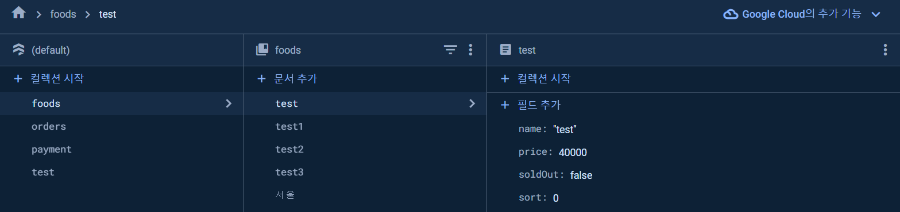

:::tip 💡
기존 작업중이던 kiosk와 admin페이지 작업을 수정 해야하는데! 수정하기 전에 어떤식으로 변경할지 기록하려구 작성 해본다

아래는 프로젝트에서 쓴 내용들!

[달력만들기- dayjs](/docs/공책/dayjs.md)

[모달-portal](/docs/공책/Portal.md)

[메뉴순서정렬 - sortableJS](/docs/공책/sortableJS.md)
:::

## 기존 방식과 파이어스토어 구조

> 기존엔 kiosk를 매장에 1대씩 있는 구조가 아닌 테이블 마다 한대씩있는 방식(술집, 라멘집 등)을 생각해서 만들었다.
>   amin페이지에선 테이블 마다 주문 내역을 확인할 수 있고 그날/그달의 매출 확인, 메뉴 관리를 할수 있게 만들고나서 생각이 들었는데 kiosk를 만들기 시작할때 내가 전에 운영했던 만두가게에서 kiosk를 사용하면 어땠을까를 생각 하면서 시작했는데 만두가게엔 kiosk가 그렇게 테이블마다 필요하지 않다고 생각이 들었다 (물론 내 기준이긴 하지만..) 그래서 가게마다 한대씩만 있어도 충분하다고 생각했고 그런 설정?으로 다시 수정을..시작 하려구 한다
>
> > 그러니까 ~ 이왕 장사할때 쓴다고 생각하면 체인점을 냈을때도 생각을 하고 만들어보면 어떨까 생각이 들었다 꿈은 클수록 좋다고 했으니까..?✌️

### 기존 파이어베이스

- foods >> 메뉴
- orders >> 테이블별 주문 내역
- payment >> 결제 내역

기존에 작업하던 구조는 이런식이였다! 어차피 매장 하나에서 사용하는 것이니.. orders 컬렉션엔 테이블 번호의 주문들을 넣어 줬음! (1번 테이블에서 주문 들어오면 1이라는 이름의 문서 안에 주문내역과 주무시간을 넣어줌)

## 변경 하려는 방식

> 일단 매장 별로 기존 구조처럼 추가를 해줘야 한다고 생각했다(매장에 kiosk를 하나씩만 둔다는 가정해 테이블 별 주문내역은 빼고)
>   고민하던중 생각이든 두가지 방식이 있는데 !!
>
> 1. 기존에 있던 각각의 컬렉션에 지점들을 넣어준뒤 해당 컬렉션의 내용을 넣어준다
>
>    - ex: foods(메뉴) > 지점명 > 메뉴컬렉션 > 메뉴 문서
>
> 2. stores라는 컬렉션을 하나 만든뒤 그아래에 각각의 지점명을 넣어주고 그 지점명 하위에 기존에 쓰던 구조들을 넣어서 관리를 한다
>
>    - ex: stores > 지점명 > [foods, orders, payments] > 각각 문서들

일단 이렇게 두가지 방식을 고민하면서 지금 글을 작성 하고있었는데 작성하다보니 두번째 방식이 더 나을꺼 같다는 생각이 든다 그래서 두번째 방식으로 할 생각이다 ㅎㅎ.. 그냥 한군데에 다 묶어 두는게 좋지 않을까..?? 아니면 뭐 ..다시 수정해야지 뭐 ..

  

### 24.04.04 수정사항

위에 두가지 방식다 해도 상관은 없는데 위 방식으로 데이터를 불러오려면 stores에 지점명에 payments 이런식으로 타고 타고 들어가야하고 특히 전지점 매출 조회할때는 지점마다 다 조회를 해야 하기때문에 약간.. 비효율 적이랄까.. 그래서 구조를 다시 수정했다!
 
기존에 사용했던 구조를 다시 사용하는데 지점마다 유니크한 값을 지정해준다 예를들어 서울지점에 1이라는 유니크 값을 주고, menu라는 컬렉션 안에 `1_[메뉴의 유니크값]` 이런식의 이름의 문서로 메뉴를 넣어주는 것이다 각각의 컬렉션안에 지점들의 메뉴,결제내역들을 넣어서 조회할때 지점코드,메뉴코드로 조회 할 수 있게 수정 했다!
 

### 추가 사항(해야함)

1. 지점을 추가 할때 미리 만들어둔 `default menu`를 바로 넣을수 있게 db에 추가했고(admin페이지에서 추가,수정,삭제 가능) 삭제 같은경우헨 `default menu`에서 특정 메뉴를 삭제하면 전 지점에 있는 메뉴들도 같이 삭제 되게 수정 했다(프렌차이즈를 생각하면 됨) ⬅️ 이런 이유들 때문에 지점,메뉴 코드로 다 조회하게끔 구조를 다시 변경했다!
2. admin페이지 로그인 기능 넣기 (아이디별 권한 설정해주기)
   - 전체 관리 권한
   - 지점 관리 권한
   - db에 비밀번호 저장시 암호화 하기 (sha256)
3. 지점 추가 기능 넣기
4. 지점별 매출달력,메뉴관리 사이드바로 빼주기

## 그럼 뭘 해야하나

작업 하기전에 해야할 것들을 정리 해둬야 겠따!!

### 24.04.04 작업끝난건 삭제 했음!

1. ~~kiosk - 시작 페이지에 지점명 입력후 지점 메뉴 출력해주기~~
   - ~~기존 주문 방식 변경해주기 (주문시 결제하기)~~
2. ~~admin - 메인페이지 에선 테이블 주문 내역이 아닌 지점들의 당일 현황이 보여져야함.~~
3. ~~admin - 지점 클릭시 지점 상세 관리 페이지(메뉴,매출등) 볼수있게 만들기!~~
4. ~~admin - 지점 추가 기능 넣어주기 (지점 이름, 번호, 주소등)~~
5. ~~admin - 사이드바 메뉴 수정하기(매출달력)~~
6. admin - 위에꺼 다 하면 로그인 만들어주기 (할수있으면..만들고싶은..?)
   - master는 모든 지점 매출확인 가능, 메뉴 추가/수정/삭제, 지점추가 등 다 가능하게
   - 지점으로 로그인시 해당 지점에 관한것만 관리 가능하게

일단 이런식으로 변경 추가 할거임! 그럼 만들러 가봐야겠다!👨‍💻

### 240405 추가 추가

#### 유니크값 지정해주기

- 지점 유니크값 : 숫자로 표기해주기 ( 1,2,3,4 등 체인점 순이라고 생각하고 넣으면 될듯 )
- default-menu 유니크값 : 파이어스토어에서 자동으로 만들어주는 문서 ID로 만들기

- 지점 메뉴 문서아이디 : 지점유니크\_메뉴유니크 이런식으로

#### 먼저 해야할것

- 마스터 메뉴관리
- 지점 추가 기능
  - 지점 추가시 메뉴는 default-menu를 넣어주기

#### 메뉴 추가 ( addFoodPopup 컴퍼넌트 )

- 시스템 권한 : 디폴트 메뉴를 추가, 수정 할 수 있게

- 지점 권한 : 본인 지점의 메뉴를 추가, 수정 할 수 있게

두가지 권한에 따라 저장하는곳이 달라져야함

지점같은경우 지점명( props로 받음 )을 api호출시 params에 넣어 해당 지점의 메뉴로 넣을수 있게 만들었음
그럼 시스템 권한도 지점명 처럼 params에 넣어준뒤 api에서 params를 기준으로 디폴트에 넣을지 지점에 넣을지 지정해주면 될듯

#### 메뉴 관리 ( Management 컴퍼넌트 ) : props로 지점명 받아주기

- 시스템 권한 : 디폴트 메뉴만 관리하게 만들기 ( db에 default-menu )
  - 사이드바에 메뉴관리 메뉴로 들어갈수 있게
  - 지점메뉴 관리도 가능하게 만듦어야함 ( 사이드바에 지점나열후 그 안에 토글메뉴로 접근 )
- 지점 권한 : 본인 지점 메뉴 관리 ( 디폴트 메뉴도 같이 들어감 )
