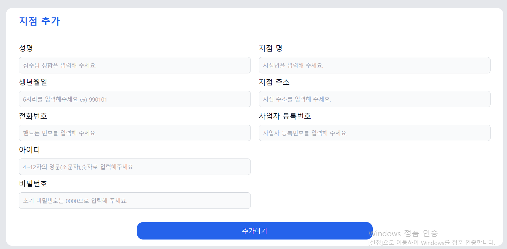
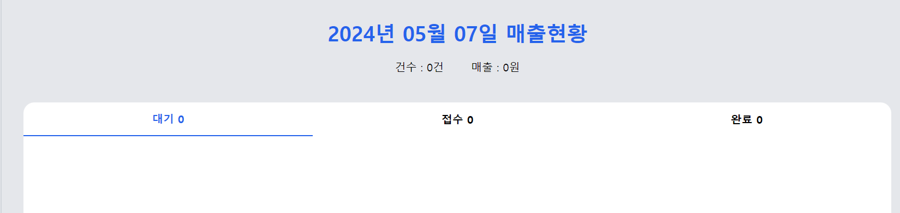

:::tip 💡
kiosk와 admin 페이지 배포까지 완료했는데 추가 해야할 사항들이 생각나서 적어두고 시작 하려함!

:::

## 통계 페이지 만들기! (admin)

> 관리 페이지니까 매출 차트가 있어야 할듯 해서 추가 하려고함  
> 일단은 매출 차트먼저 만들고 메뉴관련 차트는 이후에 추가 하는걸로 시작하려고한다!

## 지점 추가 페이지에 주소 입력란 수정하기! (admin)

> 아래 사진처럼 지점 주소에 그냥 인풋으로 돼 있는데 여기를 카카오 주소 api를 불러와서 수정해야함!  
> 주소를 넣을때 주소를 검색해서 넣는게 당연한것도 있고! 두 프로젝트 다 내가 만든 api만 있고 외부 api는 쓴게 없어서 추가 하면 딱 좋을듯 싶어서 추가하려구 한다!
> 

## 어떻게 추가 할꺼냐면~

- admin >> 통계 페이지에서 차트를 보여줄때 총 매출, 매장, 포장 별로 보여주면 좋을듯 싶음!
  - 차트는 `ApexCharts.js`를 사용할 생각이다 !
- admin >> 카카오 주소 api를 쓸 생각임!
- kiosk >> 주문시 매장, 포장을 선택 할수 있게 만들어 줘야함

### 어떤 방식으로 해야할까 ..?

> 일단~ 통계 페이지에 연도별,월별(해당 년도),일별로 보여줘야 할지 고민인데 일별 매출은 매출 달력 페이지가 있어서 만들어야 하나? 라는 생각이 들긴 하지만!! 그래도 있으면 좋을꺼 같기도하고..하니 일별도 만들어 줘야 할듯 싶다!

- admin (chart) >> api에서 fireStore 데이터를 갖고올때 해당 지점의 매출을 싹 다 갖고와서(요청 기간안의 데이터만) 총매출,매장,포장으로 묶어서 내보내 주는 방식으로 할까 한다! (클라이언트에서 특정 연도 바꾸면 해당 연도 보여줄수 있게!) 일단 해보고 피드백 받아봐야지..

  - 그럼 연, 월,일별 다른 차드를 보여 줘야하니까 토글 방식으로 차트를 보여주면 될듯하다 ( 기존 일반 관리자 페이지의 대시보드처럼!)
    > 

- 주소 api는 카카오 들어가서 보고 싸악 하면 될듯하니 별 다르게 생각할건 없을지도 .. ?
   
   

> 일단 여기까지 생각해 뒀던걸 정리해서 작성 했는데 혹시나 까먹고 못먹은게 있으면 나중에 다시 추가 하기로 하고 일단 이력서 쓰면서 위 내용들 만들어야 겠다!
