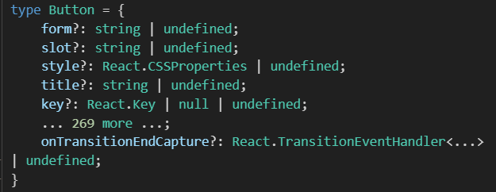

<br />
<br />

## ComponentPropsWithoutRef

`ComponentPropsWithoutRef`는 typescript에서 제공하는 리액트 컴포넌트의 props타입에서 ref속성을 제외한 타입을 만들어 주는 것으로 함수형 컴포넌트의 props를 정의할 때 사용 된다.

예를 들어 버튼 컴포넌트를 만든다고 가정하고 props를 받아야하는데 해당 태그의 기본 속성들을 받고 싶을때 사용 하면 된다.

<br />

### 사용법

```tsx
type TagProps = ComponentPropsWithoutRef<"tag name">;

type ButtonProps = React.ComponentPropsWithoutRef<"button">;

export default function Button(props: Button) {
  const { title, children, className, ...rest } = props;
  return (
    <button {...rest} className={className}>
      {children}
    </button>
  );
}
```



요렇게 담아주면 `ButtonProps`에 ref를 제외한 button의 속성들이 다 담기게 된다! 이걸 비구조화 할당을 사용해 편하게 사용 가능함!

### 이전에 사용하던 방법

```tsx
interface Button {
  title: string;
  [key: string]: any;
}

export default function Button(props: Button) {
  const { title, ...rest } = props;
  return <button {...rest}>{title} </button>;
}
```

이전에 사용하던 방법은 이런식이였는데 엄청난 꿀팁을 배운것 같다🫠

<br />
<br />

## Omit

Type에서 모든 프로퍼티를 선택하고 키를 제거한 타입을 생성

```ts
interface Todo {
  title: string;
  description: string;
  completed: boolean;
}

type TodoPreview = Omit<Todo, "description">;

const todo: TodoPreview = {
  title: "Clean room",
  completed: false,
};
```

<br />
<br />
---

본 후기는 본 후기는 [유데미x스나이퍼팩토리] 프로젝트 캠프 : Next.js 3기 과정(B-log) 리뷰로 작성 되었습니다.

```

```
