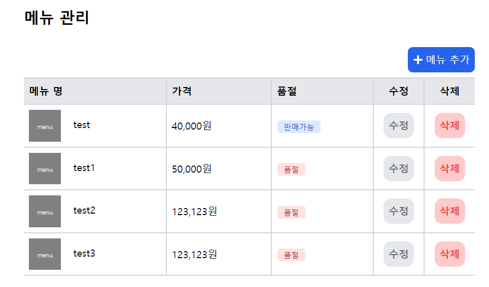
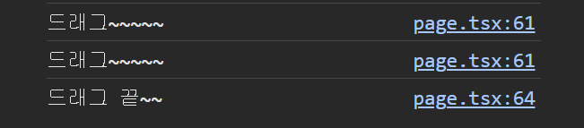
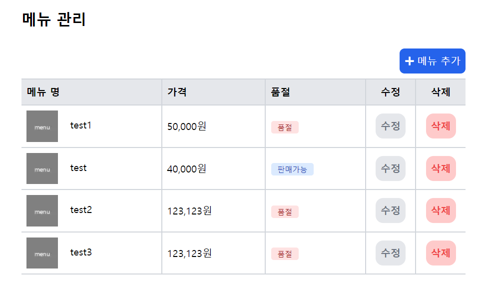
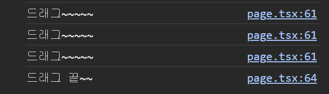
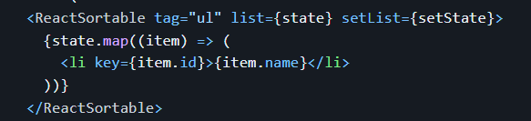
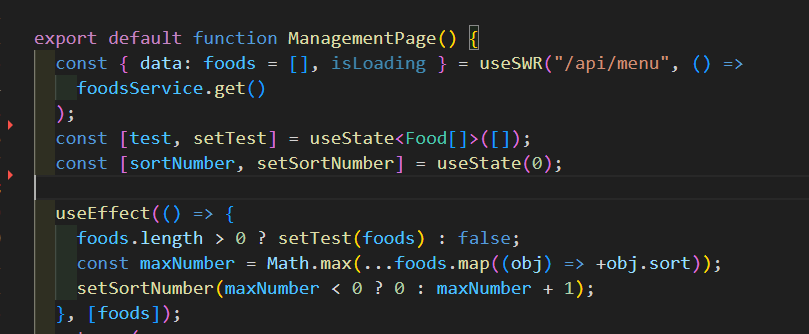

:::tip ✏️
오늘은 만두 관리자 페이지에서 메뉴 순서 정렬할때 사용한 sortableJS를 정리해보겠다!

일단 내가 하고싶었던걸 간략하게 정리해보면!

1. 메뉴들을 원하는 순서대로 배치
2. 추가한 메뉴는 일단 맨 마지막에 추가
3. 드래그 앤 드롭으로 원하는 위치에 두면 db에 해당 위치(index 번호)가 저장
   - 이렇게 하면 키오스크 페이지에도 내가 원하는 순서대로 메뉴가 정렬됨

검색해봤는데 그냥 공식 github에 있는거 따라 하니까 금방할 수 있었다!

### [요기에서 보면 됨](https://github.com/SortableJS/react-sortablejs)

:::

## 설치

```ts
npm install --save react-sortablejs sortablejs
npm install --save-dev @types/sortablejs

// OR
yarn add react-sortablejs sortablejs
yarn add -D @types/sortablejs
```

## 사용하기

먼저 공식페이지에 예시부터 보고!

```ts title="SortableJS 공식페이지"
import React, { FC, useState } from "react";
import { ReactSortable } from "react-sortablejs";

interface ItemType {
  id: number;
  name: string;
}

export const BasicFunction: FC = (props) => {
  const [state, setState] = useState<ItemType[]>([
    { id: 1, name: "shrek" },
    { id: 2, name: "fiona" },
  ]);

  return (
    <ReactSortable list={state} setList={setState}>
      {state.map((item) => (
        <div key={item.id}>{item.name}</div>
      ))}
    </ReactSortable>
  );
};
```

> 요런식으로 적용 해주면 되는데! `<ReactSortable>`에서 `list`는 드래그 앤 드롭으로 순서를 바꿔줄 배열(state)을 넣어주면 되고! `setList`에는 set함수를 넣어주면 자동으로 순서를 바꿔준다! 하지만 나는 setList를 사용 하지않고 onEnd함수를 활용해서 적용했는데 그이유는 setList함수에 console을 찍어보니 드래그 시작과 드래그 끝 날때마다 함수가 호출 되기 때문이였다.**(드래그 하는 요소가 위치를 바뀐상태면 한번더 호출됨)** 내가 한 방법이 맞는지는 모르겠지만..일단.. 나는 드래그가 끝났을때만 db를 변경 해주면 되기 떄문에 이렇게 했음.. 이게 뭔말이냐 사진으로 설명 해보자면!

- 변경하기 전의 상태

  

- 드래그 앤 드롭 후 console (위치변경 X) - 드래그 >> setList함수 // 드래그 끝 >> onEnd 함수 - 드롭후 위치가 같다면 setList두번만 호출 됨
  

- 위치 변경시! 맨위의 test메뉴를 두번째로 바꾸니 왜인지는 모르겠지만 이렇게 세번 호출 됐다..!(알아..봐야겠지..?)
  
  

> #### 뭐 이러한 이유로 onEnd함수를 사용해서 적용했고! setList함수는 꼭 넣어야 한다해서 일단.. ()=>{} 요런식으로 빈 함수를 넣었다!

<br /><br />

### 내가 적용한것!

나는 sortable을 적용하기전에 이미 만들어둔 table에 적용해봤다!
일단 `ReactSortable`을 import해줘야함! (SortableEvent는 이벤트 타입지정할때 사용!)

:::tip
아! 나는 table태그에 적용했는데 그냥 ReactSortable 태그를 넣으면 div로 들어가서 기존에 스타일 적용해둔 애들이 아주 작살이 나있었음.. 그래서 table태그 말고 div태그로 다시 만들다 공식페이지를 다시 보니....



요기 사진을보면 tag옵션이 있었다!! 저기에다가 내가 사용하려는 태그를 입력해주면 된다는!!!!..사실을 스타일을 수정하는 삽질을 하다 알게 됐다!! 그래.. 분명 편하게 쓰라고 만들었을텐데 div태그로만 될리가 없지.. 앞으론 공식페이지를 더 자세해 봐야겠다🫠
:::

```ts title='management page'
import { ReactSortable, SortableEvent } from "react-sortablejs";

        <ReactSortable
          tag={"tbody"}
          animation={200}
          list={test}
          setList={() => {
            console.log("드래그~~~~~");
          }}
          onEnd={(e: SortableEvent) => {
            console.log("드래그 끝~~");
            const list = [...test];
            const obj = list.splice(e.oldIndex as number, 1);
            list.splice(e.newIndex as number, 0, ...obj);
            setTest(list);
            foodsService.sort(list);
          }}
        >
          {test.map((food, i) => (
            // 요기는 드래그 할 요소 넣기~~
          ))}
        </ReactSortable>
```

> 코드를 다 적긴 그래서 table태그에서 순서만 tbody부분만 갖고왔다. 여기서 `e.oldIndex`는 기존에 있던 위치의 인덱스 번호이고 `e.newIndex`는 새로운 위치의 인덱스 번호이다 그러니 이번호를 활용해서 `setList`처럼 바로 드롭된 곳에 위치하게 하게할 수 있었고 수정된 배열을 api에보내서 해당 메뉴의 index번호를 수정할 수 있게 만들었다!
>
> > 아 그리구 `test`는(수정할거임) 이런식으로 세팅 해줬다 왜냐하면 위에 작성한것 처럼 드래그 이후 바로 위치하게 하기 위해..? 내 최선의 방법이였달까..
> > 
> > useSWR로 받아온 메뉴를 `useEffect`를 사용해 넣어줬는데 의존성 배열에 Foods를 넣어준 이유는 메뉴를 추가 수정 해야할 때 마다 메뉴의 위치도 바뀌고 해야하기 때문에!
>
> #### 코드가 지저분한게 정말 마음에 안들지만 일단은.. 일단은 만들어 보고 .. 다시 리팩토링 해보는걸로 하자고.. 오늘글은 여기까지!! (수정사항 있으면 다시 수정할거임.)
